# Graphwar指南

这是一份简易的Graphwar指南，说它简易是因为该指南假设读者会自行探索游戏中的内容，所以不会对一试便知的内容进行解释，也就是说，该指南不会把你当作白痴一样照顾。这份指南包含了一些玩这游戏应当了解的内容以及一些有用的技巧。我自己的话其实也没玩多久，也算是一个小资历，所以指南多多少少可能会有一些疏漏或者错误，如果你找到了某些问题或者有改进的建议，希望你能告诉我。

总之，Graphwar是一款数学函数射击游戏，你必须使用数学函数来击中你的敌人。你发射的子弹的轨迹由你输入的函数决定，你的目标是避开障碍物和你的队友，击中你的敌人。游戏发生在笛卡尔平面上。——译自官方介绍。

## 目录

- [Graphwar指南](#graphwar指南)
  - [目录](#目录)
  - [你必须知道的事实](#你必须知道的事实)
  - [符号](#符号)
    - [变量](#变量)
    - [二元运算](#二元运算)
    - [函数](#函数)
    - [常量](#常量)
    - [括号](#括号)
  - [有用的公式](#有用的公式)
    - [台阶(Sigmoid)函数:](#台阶sigmoid函数)
    - [尖刺函数:](#尖刺函数)
    - [双绝对值函数:](#双绝对值函数)
    - [正余弦函数:](#正余弦函数)
    - [通用台阶函数:](#通用台阶函数)
    - [分段函数拟合:](#分段函数拟合)
    - [周期尖刺函数](#周期尖刺函数)
    - [周期通用台阶函数:](#周期通用台阶函数)
  - [微分方程模式](#微分方程模式)
    - [机制](#机制)
      - [算法](#算法)
    - [技巧](#技巧)
      - [`y'`模式](#y模式)
      - [`y''`模式](#y模式-1)
      - [如果哪天开发者破天荒地推出了 $y^{(n)}$ 模式](#如果哪天开发者破天荒地推出了-yn-模式)

## 你必须知道的事实

游戏有两支队伍，每个玩家必须只能在其中一支队伍中。

只有当所有人点击了$\checkmark$按钮并且变成绿色的时候，游戏才会开始，所以，别进入游戏后干愣着，别让其他人等你。

有点恶心人的一点是由于某些原因，比如有人加入或者离开房间，会让你变回白色。使你必须重新点击按钮。

你和你的队友永远都在左侧 ($x<0$)。你的敌人永远在右侧 ($x>0$)。如果分不清左右的话可以通过士兵的朝向来辨别敌我：朝向右边的是你和你的队友，朝向左边的是你的敌人。这个游戏有友伤，所以别把你队友一枪崩了求求了，我已经因为这样似过好多次了。

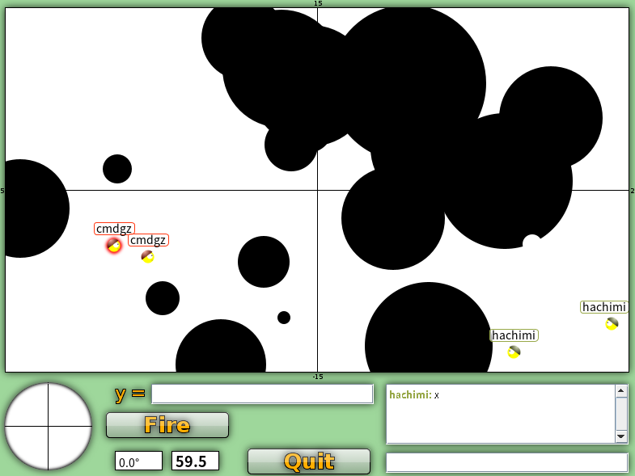

当进入你的回合，你所操控的其中一个士兵会变红，现在你可以在函数输入框内输入任何的函数表达式，点击 "Fire" 按钮或者按回车键就可以发射子弹，子弹将会根据你输入的函数表达式对应的曲线从左向右运动，每一回合你只能发射一次。

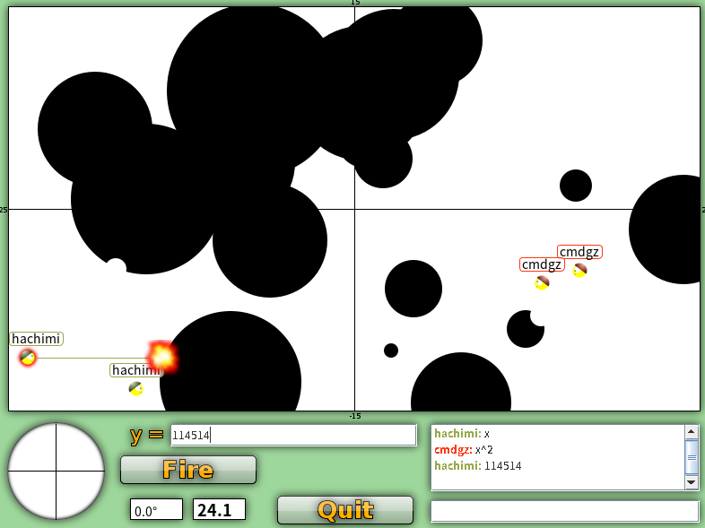

在普通模式 (`y`模式) 中 (至于[微分方程模式](#微分方程模式)，也就是`y'`和`y''`模式，我稍后再讲) 假设你输入的函数为 $f$ ，你的坐标为 $(x_0,y_0)$ ，那么你的子弹的实际运动曲线是:

$$
f_{\text{real}}(x)=f(x)+(y_0-f(x_0))
$$

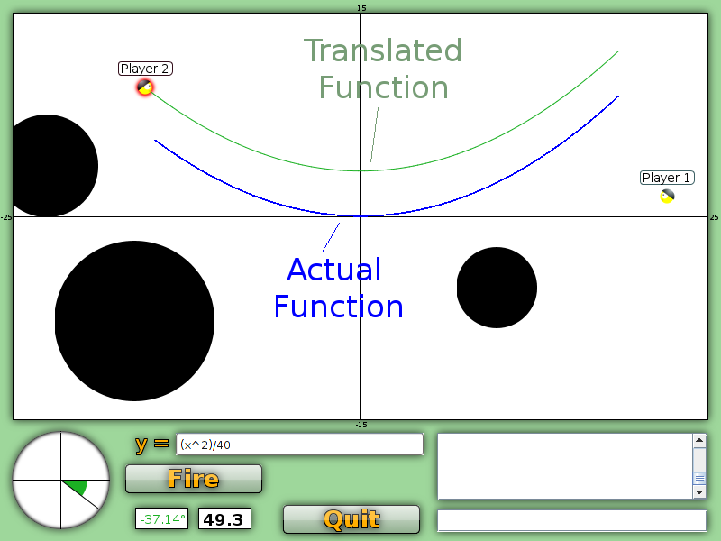

也就是说，游戏通过上下平移你输入的函数来确保你的子弹的实际运动曲线会经过发射点，而不是将发射点设为函数的原点，这就是当你输入诸如 $x^2,x^3$ 之类的函数可能会得到一条非常陡峭的曲线的原因，尝试输入诸如 $(x-x_0)^2$ 或者给函数乘以一个小系数可能会好些。

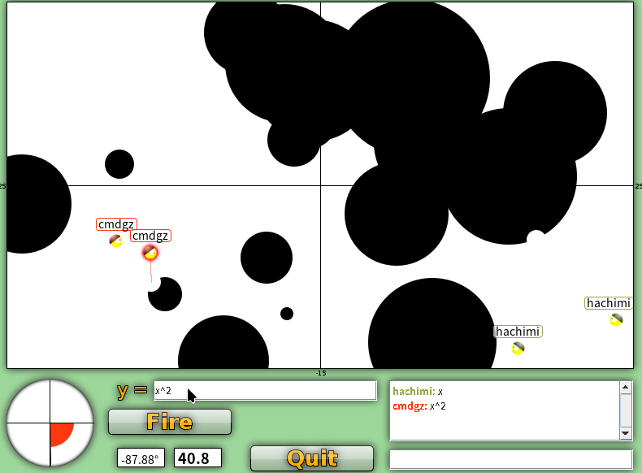

显然，函数 $f_{\text{real}}$ 只定义在 $x\ge x_0$ 的区域，所以曲线不存在于 $x<x_0$ 的区域。

由于你只能输入函数表达式，而一个函数意味着一个输入 $x$ 仅能至多对应一个输出 $f(x)$ ，因此多值函数是不可能的，所以显然子弹没办法向左，也就是向 $-x$ 方向运动。

这些黑不拉几的圆圈是障碍，如果子弹击中了它们，子弹会爆炸并产生一个小洞，然后子弹会消失。

如果子弹击中了敌人或者友军，他们会被子弹击杀，但子弹不会消失，而是会继续运动。

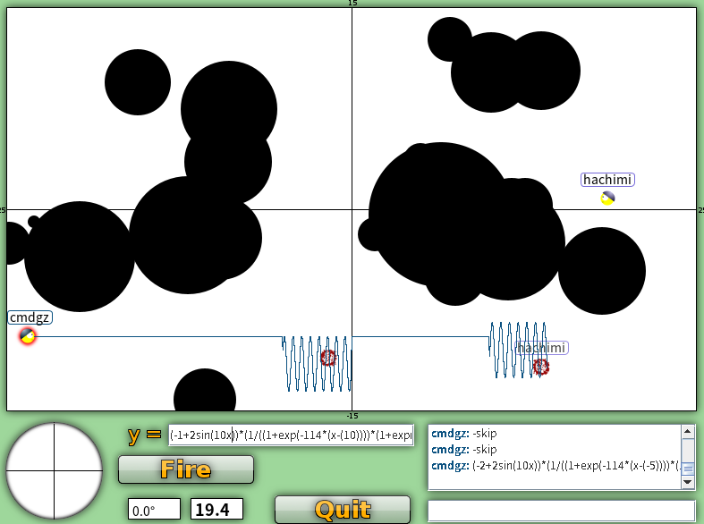

粗略且理想化地说，战场是一个 $[-25,25]\times[-15,15]$ 的矩形区域，若子弹击中边界，子弹会消失。

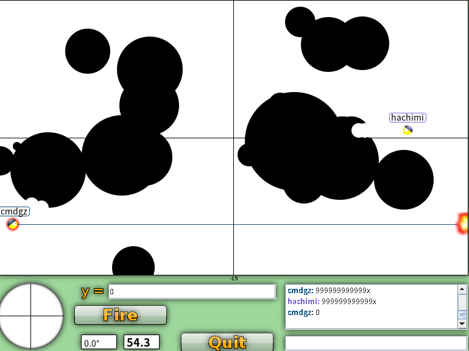

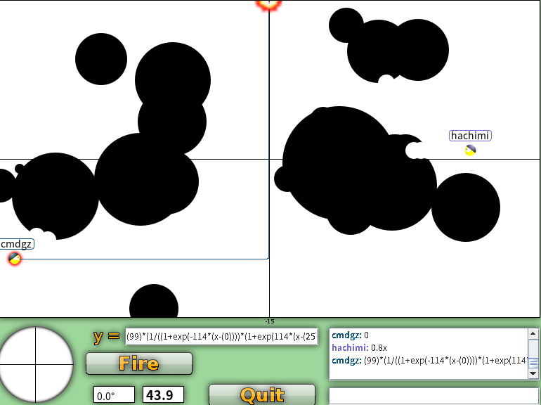

准确地说，在 Graphwar I，由于某些特性，战场实际上是 $[-25,25)\times[-\frac{1125}{77},\frac{1125}{77})$，其中 $25=\frac{50\cdot 770}{770\cdot2},\frac{1125}{77}=\frac{50\cdot 450}{770\cdot 2}\approx 14.6103896$

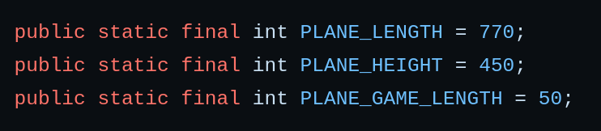

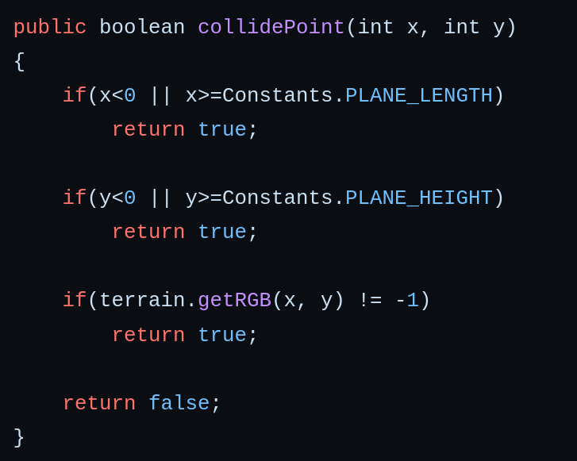

如果子弹经过了一个对于函数来说未定义的点，比如 $y=\sqrt x$ 且子弹经过了一个 $x<0$ 的坐标，那么子弹也会消失。

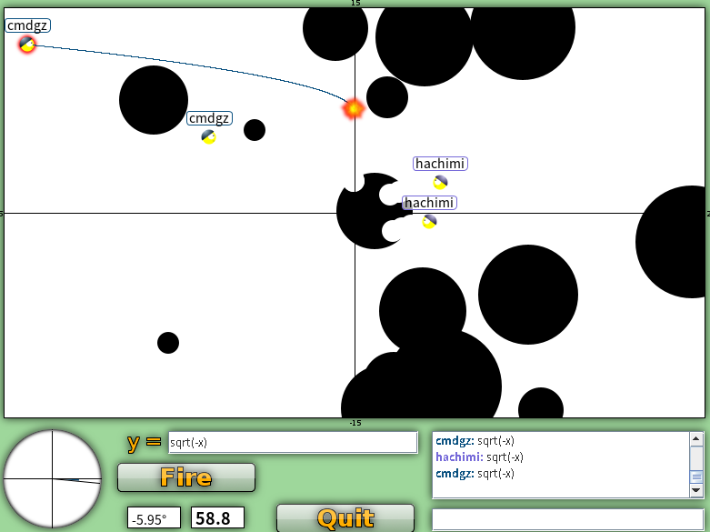

如果函数值太大，或者更基本地说，当计算函数值时中间值出现了 `NaN` ，则子弹会消失。

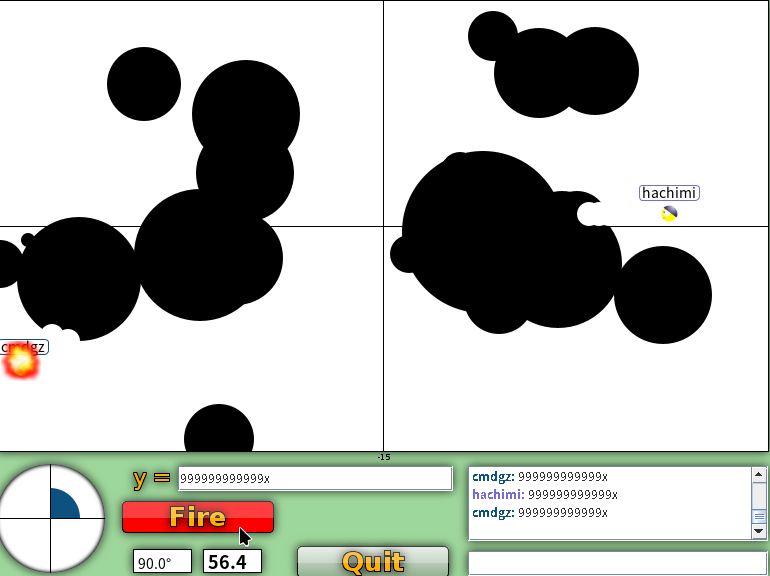

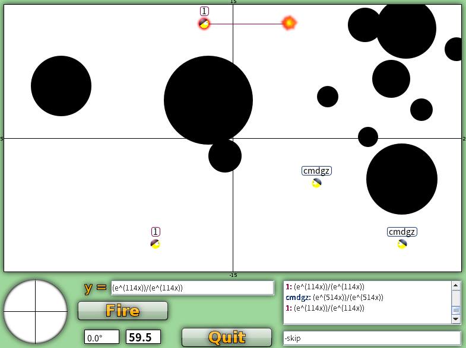

子弹运动距离，也就是函数曲线的长度，是有限的，如果距离太长，子弹会消失，这就是为什么诸如 $\sin(100x)$ 通常无法跑得太远。

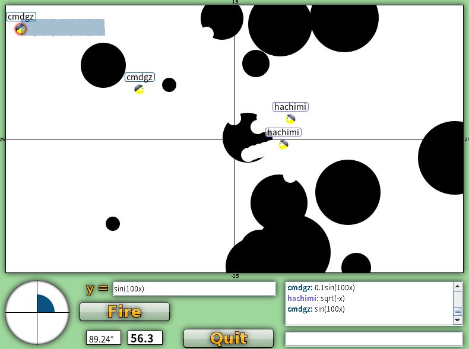

游戏的地图是随机的，如果你得到了一张傻逼地图，可以在聊天框中输入`-skip`并请求其他人也输入它，若所有人都输入了`-skip`，则游戏会重新生成一张随机地图。

## 符号

### 变量

- `x`:  $x$
- `y`:  $y$
- `y'`: $y'$

### 二元运算

- `+`: $+$
- `-`: $-$
- `*`: $\times$
- `/`: $\div$
- `^`: 幂运算，比如 `x^2` 是 $x^2$

### 函数

- `sqrt()`: 平方根，比如 `sqrt(x)` 是 $\sqrt{x}$
- `ln()`: 自然对数，比如 `ln(x)` 是 $\ln(x)$
- `log()`: 通用对数，比如 `log(x)` 是 $log_{10}(x)$
- `abs()`: 绝对值，比如 `abs(x)` 是 $|x|$
- `sin()` 或 `sen()`: 正弦，比如 `sin(x)` 是 $sin(x)$
- `cos()`: 余弦，比如 `cos(x)` 是 $cos(x)$
- `tan()` 或 `tg()`: 正切，比如 `tan(x)` 是 $tan(x)$
- `exp()`: 指数，比如 `exp(x)` 是 $e^x$

### 常量

- `pi`: $\pi$
- `e`: $e$

### 括号

- `(` 和 `)`: 括号，多用括号以避免错误的运算顺序。

## 有用的公式

本节中有部分内容参考了 [Graphwar Tutorial Sant Albert '12](https://www.youtube.com/watch?v=E_MmkxTO5kg) 和 [graphwar meta that i use (EN)](https://www.youtube.com/watch?v=EHuQe7SKwkA)

你可以用加法和乘法来组合本节中的公式，抽象地说，加法意味着"或"，乘法意味着"和"。

### 台阶(Sigmoid)函数:

$$
\frac{k}{1+e^{-m(x-a)}}
$$

即：`((k)/((1+exp(-m*(x-(a))))))`

其中$m\in\mathbb{R}_+$是个比较大的正数。

该函数是以下函数的近似：

$$
\begin{cases}
0, & x\lt a\\
k, & x\ge a
\end{cases}
$$

即：若 $x\lt a$ 数值为 $0$ ，若 $x\ge a$，函数值为 $k$ 。

特别地，令$k$为负数可以让子弹向下移动。

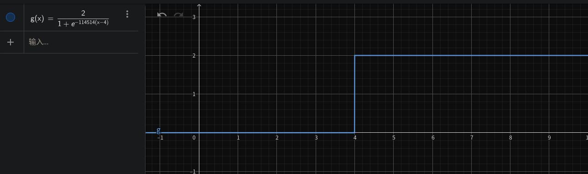

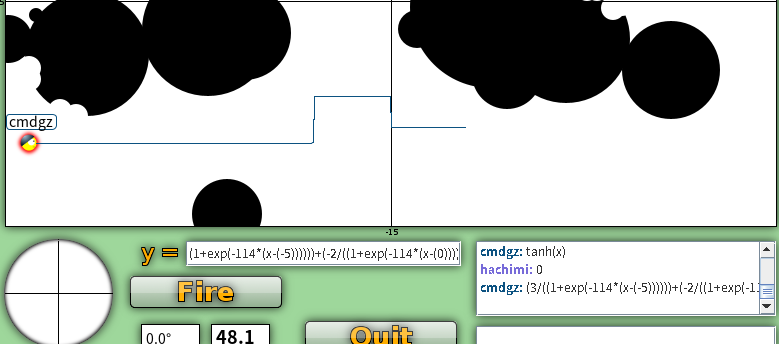

这是一个很有用且简单的函数，可以被用来移动和躲避障碍物。

### 尖刺函数:

$$
\frac{h}{1+m(x-a)^2}
$$

即：`((h)/(1+m*(x-a)^2))`

其中 $m\in\mathbb{R}_+$ 是个比较大的正数。

这个函数会在 $x-a$ 处生成一个尖刺，高度为 $h$ 。

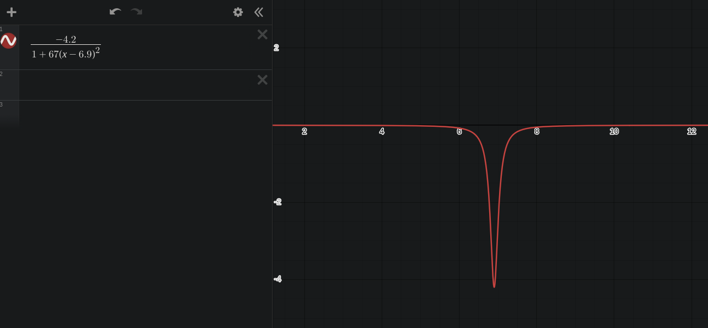

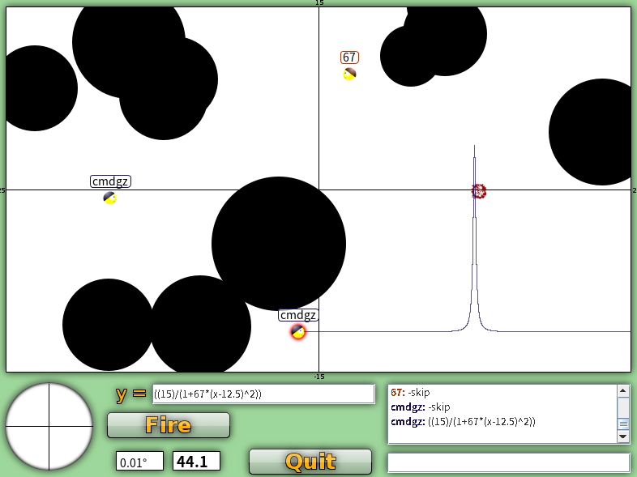

比起用类似 $\frac{h}{1+m(x-a)^2}+\frac{-h}{1+m(x-a-0.1)^2}$ 的玩意，这个函数要简洁且易用。

### 双绝对值函数:

$$
\frac{k}{2}(|x-a| - |x-b|)
$$

即：`(0.5*(k)(abs(x-(a))-abs(x-(b))))`

其中 $a<b$

该函数与下面的函数等价：

$$
\begin{cases}
-\frac{k}{2}|a-b|, & x\lt a\\
k(x-a)-\frac{k}{2}|a-b|, & x\in[a,b]\\
\frac{k}{2}|a-b|, & x\gt b
\end{cases}
$$

即：当 $x\lt a$ 时，函数值为 $-k/2|a-b|$ ，当 $x\in[a,b]$ 时，函数值为 $k(x-a)-k/2|a-b|$ ，当 $x\gt b$ 时，函数值为 $k/2|a-b|$ 。

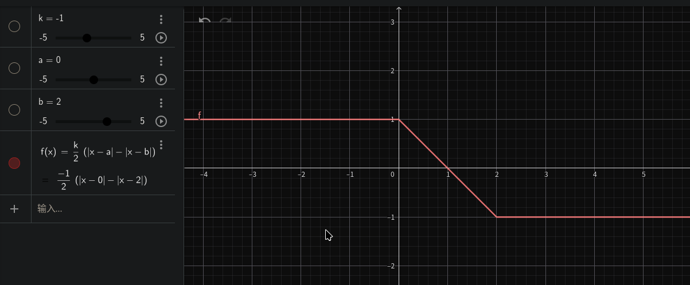

**很多挂狗子都喜欢用这个函数。如果你看到有人发了一大串这玩意，那十有八九就是了。**

### 正余弦函数:

虽然 $\sin$ 和 $\cos$ 很基础，但显然如果你给它们一个大角速度和一个大振幅，它们在清场这块就会很有用。

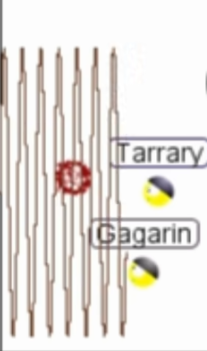

### 通用台阶函数:

$$
\frac{f(x)}{1+e^{-m(x-a)}}
$$

即：`((f)/((1+exp(-m*(x-(a))))))`

其中 $m\in\mathbb{R}_+$ 是个比较大的正数。

该函数是以下函数的近似：

$$
\begin{cases}
0, & x\lt a\\
f(x), & x\ge a
\end{cases}
$$

即：若 $x\lt a$ ，函数值为 $0$ ，若 $x\ge a$ ，函数值为 $f(x)$ 。

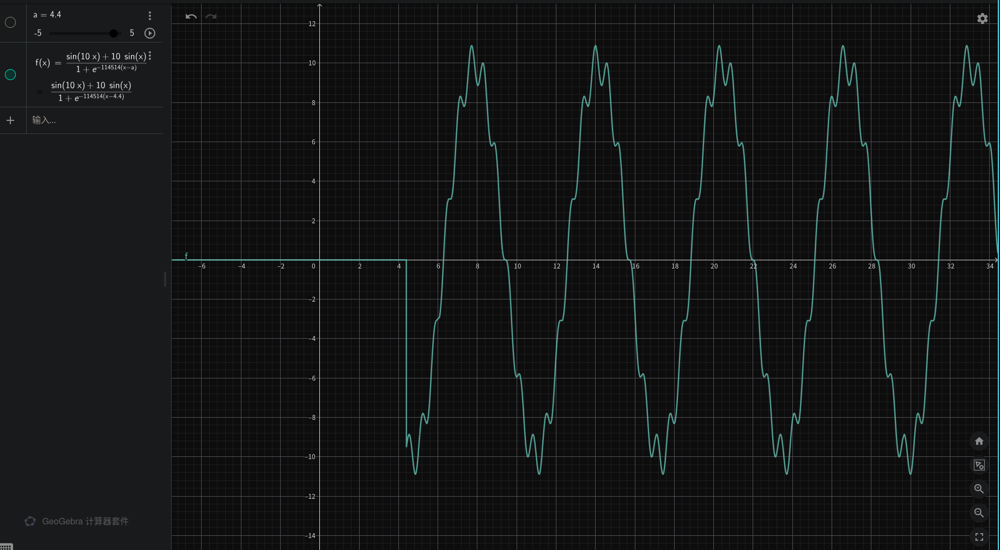

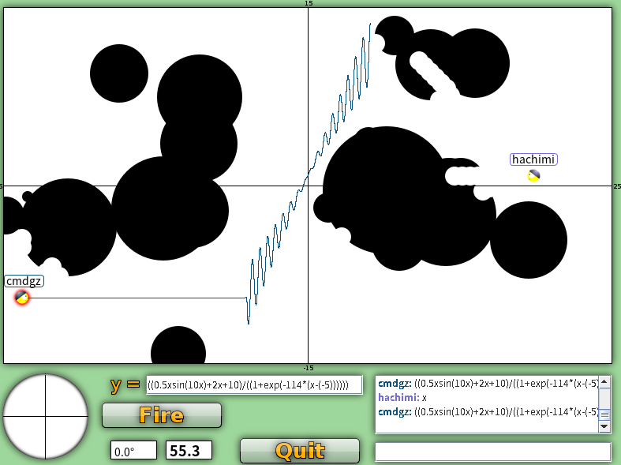

这个函数可以被用来让任何函数 $f(x)$ 在经过特定点后才工作，但如果你想让它在一个区间内工作，那它就不太好用了，你需要下面这玩意。

### 分段函数拟合:

令

$$
\mathbf 1_{(a,b)}(x)=\frac{1}{(1+e^{-m(x-a)})(1+e^{m(x-b)})}
$$

即：`(1/((1+exp(-m*(x-(a))))*(1+exp(m*(x-(b))))))`

其中 $m\in\mathbb{R}_+$ 是一个比较大的正数，且 $a<b$

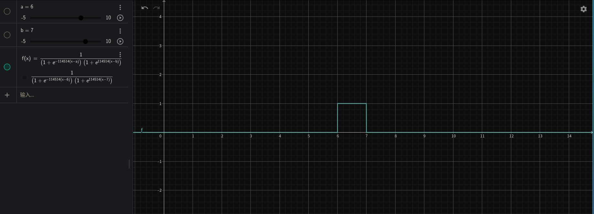

以用来近似指示函数：

$$
\mathbb1_{[a,b]}(x)=
\begin{cases}
1, & x\in[a,b]\\
0, & \text{Otherwise}
\end{cases}
$$

你可能注意到了，该函数只是台阶函数与其变体的乘积。

（另外我通过组合幂函数构造了另一个版本的 $\mathbf 1_{(a,b)}(x)$，差不多长这样：$\mathbf1_{(a,b)}(x)=\left(1+\left(\frac{x-\frac{a+b}{2}}{\frac{a-b}{2}}\right)^{2m}\right)^{-1}$. 但它并不好用，因为需要替换 $a$ 和 $b$ 各两遍，且 $m$ 必须是一个自然数。）

现在让我们来考虑这个分段函数：

$$
f(x)=
\begin{cases}
f_1(x), & x\in[a_1,b_1]\\
f_2(x), & x\in[a_2,b_2]\\
\vdots\\
f_n(x), & x\in[a_n,b_n]\\
0, & \text{Otherwise}
\end{cases}
$$

其中 $a_i<b_i$ ，且 $i=1,2,\cdots,n$

这个分段函数可以被以下函数近似:

$$
f(x)\approx\sum_{i=1}^n\mathbf1_{(a_i,b_i)}(x)f_i(x)
$$

即一系列这玩意的和：`((f)*(1/((1+exp(-m*(x-(a))))*(1+exp(m*(x-(b)))))))`

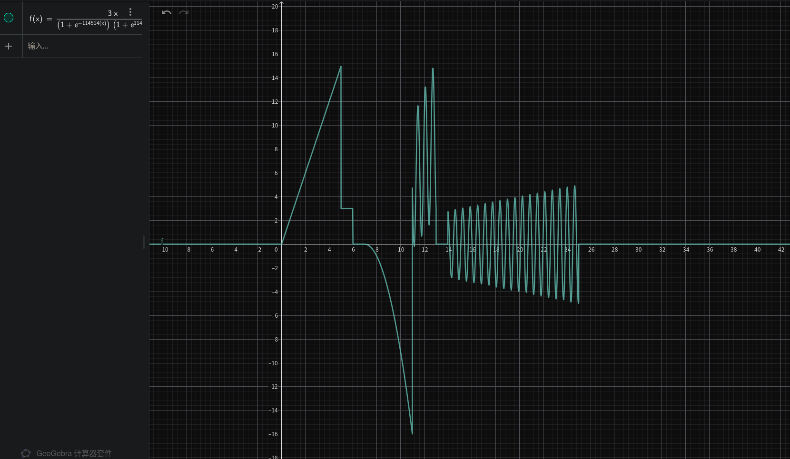

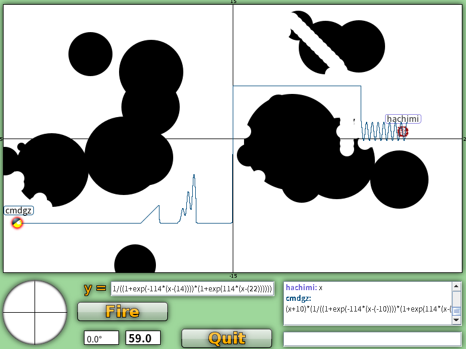

如果你和我一起玩过这游戏，你大概会看到我经常用这玩意来构造任何我想要的函数，这玩意实在是太好用了，对我来说这算是最好的函数之一了。

### 周期尖刺函数

$$
\frac{h}{(1+m(\sin(\frac{\pi x}{T}))^2)}
$$

即：`((h)/(1+m*(sin((pi*x)/(T)))^2))`

其中 $m\in\mathbb{R}_+$ 是个比较大的正数。

这个函数会每隔 $T$ 个单位就生成一个尖刺，高度为 $h$。

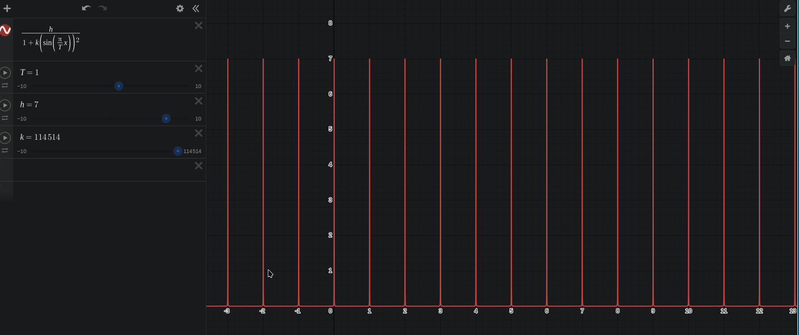

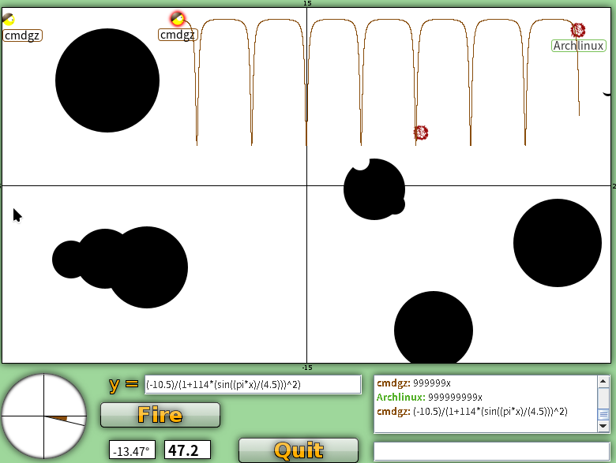

这函数可以通过造出一堆尖刺来实现大范围清场。

### 周期通用台阶函数:

$$
\frac{f(x)}{1+e^{-m\left(\sin\left(\frac{\pi(x-p)}{T}\right)\sin\left(-\frac{\pi x}{T}\right)\right)}}
$$

即：`((f)/(1+exp(-m*(sin(pi*(x-p)/(T))sin(-(pi*x)/(T))))))`

其中 $m\in\mathbb{R}_+$ 是个比较大的正数， $T$ 是周期，且 $p\in(0,T)$ 。

在一个周期 $[kT,kT+T)$ 中，当 $x\in[kT,kT+p)$ 时函数为 $f$ 否则为 $0$ 。

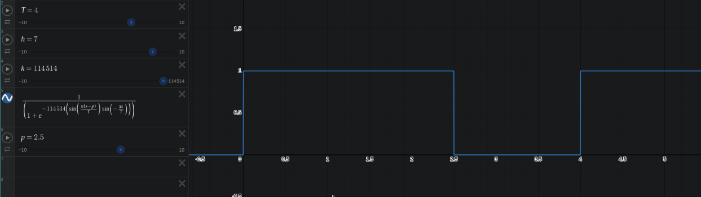

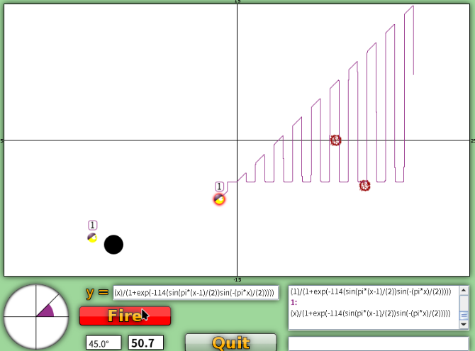

基于这个函数可以整出一堆有趣的活。

## 微分方程模式

### 机制

如你所见，ODE 模式有两种模式：`y'`模式和`y''`模式，对应 $y$ 对于 $x$ 的一阶和二阶导数。

如同普通模式，你可以在输入框内输入任何函数表达式来设置你的子弹轨迹。但它允许你使用除了 $x$ 以外的变量，`y'`模式中允许 $y$ ，在`y''`模式中允许 $y,y'$ 。(对于`y'`. 前面的版本有个bug，它会匹配`y`而不是`y'`. 但已经修复了，所以记得更新游戏。)

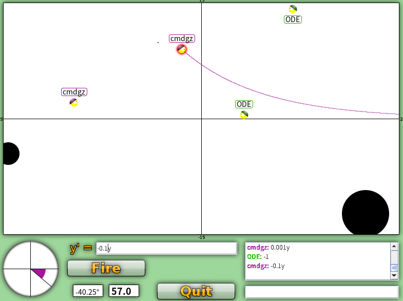

如[符号](#符号)中所述，`y`指的是 $y$ ，`y'`指的是 $\frac{dy}{dx}$ 。

游戏将你输入的表达式看作一个（显式）常微分方程（ODE）来描述你的子弹轨迹，而不是一个函数，但本质上它仍然是一个函数，所以和普通模式一样，你不能让你的子弹向左移动。

假设你已经理解了上面的那坨解释，接下来我要来说明在ODE模式中子弹具体会怎么运动。

假设发射者的坐标为$(x_0,y_0)$。

对于一阶ODE，也就是`y'`模式，设你输入的表达式是 $E(x,y)$ ，那么对应的子弹轨迹是以下微分方程初值问题（IVP）的解：

$$
\begin{cases}
\frac{dy}{dx}=E(x,y)\\
y(x_0)=y_0
\end{cases}
$$

对于二阶ODE，也就是`y''`模式，子弹的运动轨迹同样是某个IVP的解，但显然你需要有两个初始条件，而不只是一个。第一个初始条件也是发射者的坐标，游戏将发射角度作为第二个初始条件，它可以通过在你的回合中按下上下箭头键来调整。

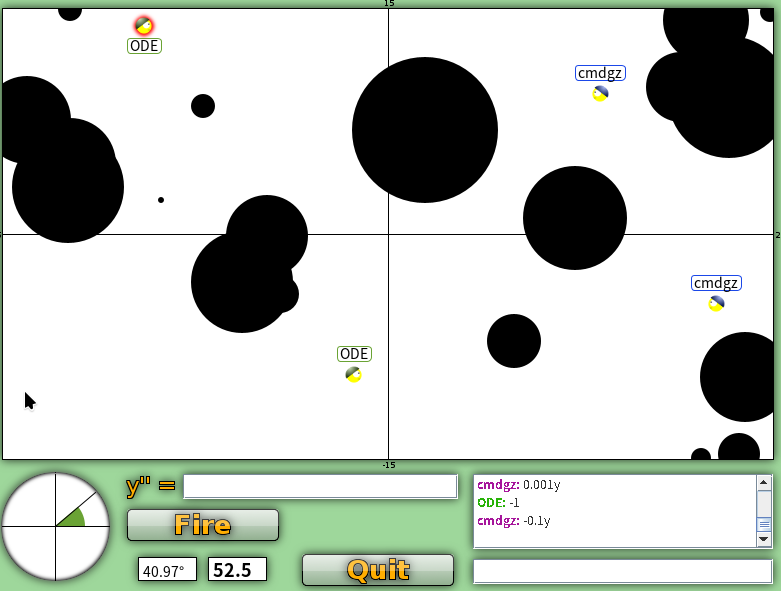

设发射角为 $\theta$ ，你输入的表达式是 $E(x,y,\frac{dy}{dx})$ （即 $E(x,y,y')$ ），那么对应的子弹轨迹是以下IVP的解：

$$
\begin{cases}
\frac{dy}{dx}=E(x,y,\frac{dy}{dx})\\
y(x_0)=y_0\\
\frac{dy}{dx}(x_0)=\tan\theta
\end{cases}
$$

#### 算法

无论是在`y'`还是`y''`，Graphwar使用四阶龙格库塔法来计算子弹轨迹，因为任何的 $m$ 阶显式ODE都等价于一个一阶ODE系统，如下所示：

$$
\begin{align*}
\frac{d^my}{dx^m}=f(x,y,\frac{dy}{dx},\frac{d^2y}{dx^2},\cdots,\frac{d^{m-1}y}{dx^{m-1}})\\
\end{align*}
$$

等价于

$$
\begin{cases}
\frac{dy_1}{dx}=y_2\\
\frac{dy_2}{dx}=y_3\\
\vdots\\
\frac{dy_{m-1}}{dx}=y_m\\
\frac{dy_m}{dx}=f(x,y_1,y_2,\cdots,y_m)\\
\end{cases}
$$

所以更一般地，考虑以下 $m$ 元一阶ODE系统的IVP：

$$
\begin{cases}
\frac{d\mathbf y}{dx} = \mathbf f\bigl(x, \mathbf y(x)\bigr)\\
\mathbf y(x_0) = \mathbf y_{0}
\end{cases}
\qquad (1)
$$

其中 $\mathbf y\in\mathbb R^m,\mathbf f:\mathbb R\times\mathbb R^{m}\to\mathbb R^{m}$.

令

$$
\begin{aligned}
\mathbf Y(x)
&=
\begin{pmatrix}
Y_0(x)\\
Y_1(x)\\
\vdots\\
Y_m(x)
\end{pmatrix}
{:}=
\begin{pmatrix}
x\\
\mathbf y(x)
\end{pmatrix},
\\
\mathbf F(\mathbf Y)
&=
\begin{pmatrix}
F_0(\mathbf Y)\\
F_1(\mathbf Y)\\
\vdots\\
F_m(\mathbf Y)
\end{pmatrix}
{:}=
\begin{pmatrix}
1\\
\mathbf f(x, \mathbf y)
\end{pmatrix}.
\end{aligned}
\qquad (2)
$$

则 $(1)$ 等价于如下自洽系统：

$$
\begin{cases}
\frac{d\mathbf Y}{dx} = \mathbf F(\mathbf Y)\\
\mathbf Y_0=\mathbf Y(x_0)
\end{cases}
\qquad (3)
$$

令 $h$ 为步长，则四阶龙格库塔法的递推公式如下：

$$
\boxed{
\begin{aligned}
&\mathbf{K}_1 = \mathbf{F}(\mathbf{Y}_n),\\
&\mathbf{K}_2 = \mathbf{F}\left(\mathbf{Y}_n + \frac{h}{2}\mathbf{K}_1\right),\\
&\mathbf{K}_3 = \mathbf{F}\left(\mathbf{Y}_n + \frac{h}{2}\mathbf{K}_2\right),\\
&\mathbf{K}_4 = \mathbf{F}\left(\mathbf{Y}_n + h\mathbf{K}_3\right),\\
\hline
&\mathbf{Y}_{n+1} = \mathbf{Y}_n + \frac{h}{6}\Bigl(\mathbf{K}_1 + 2\mathbf{K}_2 + 2\mathbf{K}_3 + \mathbf{K}_4\Bigr).\\
\end{aligned}
} \qquad (4)
$$

用 $(4)$ 的递推公式计算 $\mathbf{Y}_0\cdots,\mathbf{Y}_n$ ，就可以得到 $\{\mathbf{Y}_0,\mathbf{Y}_1,\cdots,\mathbf{Y}_n\}$ ：$(1)$ 在 $[x_0,x_0+nh]$ 中的图像点集，误差为 $o(h^4)$。

特别地，在`y'`模式，我们有：

$$
\mathbf Y=\begin{pmatrix}x\cr y\end{pmatrix},\mathbf F=\begin{pmatrix}1\cr E\end{pmatrix},
$$

在`y''`模式，我们有：

$$
\mathbf Y=\begin{pmatrix}x\cr y\cr y'\end{pmatrix},\mathbf F=\begin{pmatrix}1\cr y'\cr E\end{pmatrix}.
$$

游戏中算法的具体实现如下：

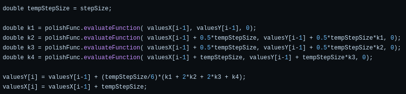
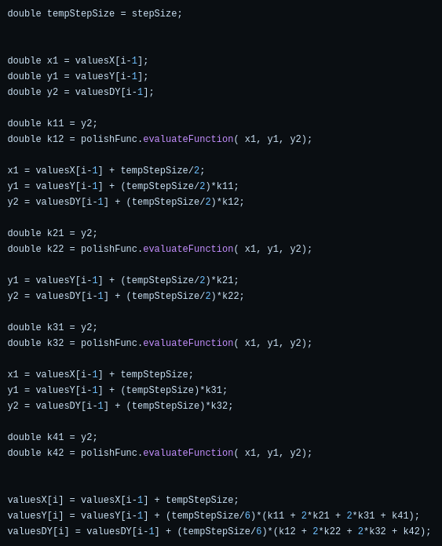

### 技巧

你大概会说在ODE模式中构建一条能用的曲线很难，看上去普通模式中的函数和技巧好像在这里都没什么用，因为看起来你必须计算那些函数的一阶甚至二阶导，这显然通常会很复杂，甚至对于诸如`abs()`这样不可导的函数来说是几乎不可能的，但如果我告诉你有很简单的方法就可以在ODE模式中近似在普通模式中的函数，且不需要任何求导操作呢？

现在我假设你要构造的函数是 $f$ ，下面的方法可以让子弹的运行轨迹**正好就是**该函数的近似，也就是说，不像在普通模式，$f$将不会被上下平移，如果你使用这个技巧，你就完全不需要猜测发射者的$y_0$，从这点来看，ODE模式似乎比普通模式简单。

令 $M$ 为一个较大的正数，一般 $M=233$ 之类的就够了。（如果 $M$ 太大，子弹的运行轨迹会很快出现大的波动，运行轨迹的长度会很快超出上限。）

#### `y'`模式

$$
M(-y+f)
$$

即：`M*(-y+(f))`

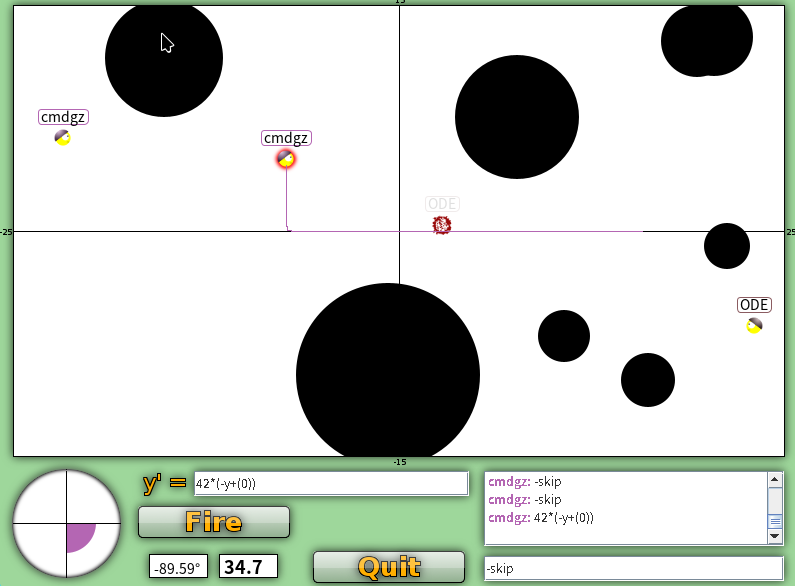

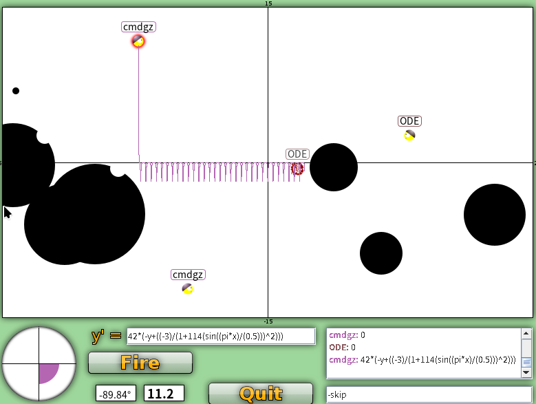

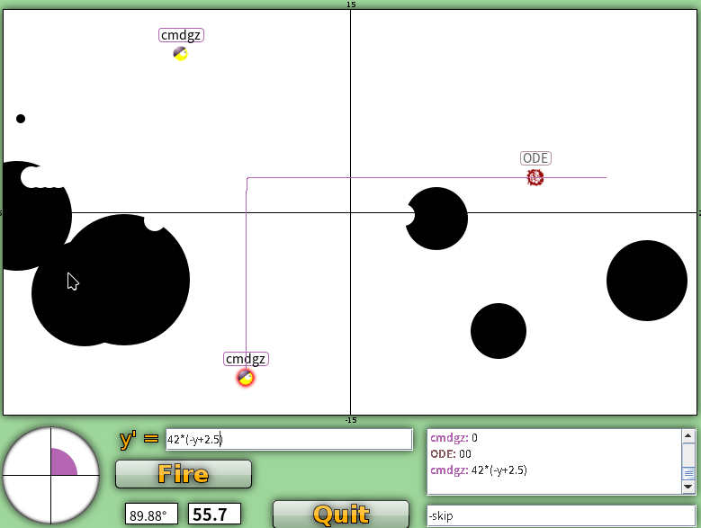

以下是对该公式的可行性证明：

**命题：**

令 $f$ 是一个可微函数，其中 $f'$ 有界。考虑以下IVP：

$$
\begin{cases}
\frac{dy}{dx}=M(-y+f(x))\\
y(x_0)=y_0
\end{cases}
$$

证明对于 $x>x_0$ ，当$M\to+\infty$时其解将会收敛到 $f(x)$ 。特别地，$y(x)=f(x)+\text{O}(\frac{1}{M})$。

**证明：**

​	由于这是一个一阶线性ODE

​	所以解为：

$$
y(x)=e^{-M(x-x_0)}y_0+e^{-Mx}\int_{x_0}^xMf(t)e^{Mt}dt
$$

​	所以我们有：

$$
\begin{aligned}
y(x)&=e^{-M(x-x_0)}y_0+e^{-Mx}\int_{x_0}^xMf(t)e^{Mt}dt\\
&=e^{-M(x-x_0)}y_0+e^{-Mx}\int_{x_0}^xf(t)de^{Mt}\\
&=e^{-M(x-x_0)}y_0+e^{-Mx}\left.f(t)e^{Mt}\right|_{x_0}^x-e^{-Mx}\int_{x_0}^xe^{Mt}df(t)\\
&=e^{-M(x-x_0)}y_0+f(x)e^{Mx}e^{-Mx}-f(x_0)e^{Mx_0}e^{-Mx}-e^{-Mx}\int_{x_0}^xe^{Mt}f'(t)dt\\
&=f(x)+(y_0-f(x_0))e^{-M(x-x_0)}-e^{-Mx}\int_{x_0}^xe^{Mt}f'(t)dt\\
&=f(x)+\text{O}(\frac{1}{e^M})-e^{-Mx}\int_{x_0}^xe^{Mt}f'(t)dt\\
\end{aligned}
$$

​	对于 $x>x_0$ ，由于：

$$
\lim\limits_{M\to+\infty}(y_0-f(x_0))e^{-M(x-x_0)}=0
$$

​	所以：

$$
y(x)=f(x)-e^{-Mx}\int_{x_0}^xe^{Mt}f'(t)dt+\text{O}(\frac{1}{e^M})
$$

​	由于 $f'$ 有界

​	所以考虑 $\left|e^{-Mx}\int_{x_0}^xe^{Mt}f'(t)dt\right|$ ，我们有：

$$
\begin{aligned}
\left|e^{-Mx}\int_{x_0}^xe^{Mt}f'(t)dt\right|&\le e^{-Mx}\int_{x_0}^x|e^{Mx}||f'(x)|dx\\
&\le (\sup|f'|)e^{-Mx}\int_{x_0}^xe^{Mx}dx\\
&\le (\sup|f'|)e^{-Mx}\frac{e^{Mx}-e^{Mx_0}}{M}\\
&\le (\sup|f'|)e^{-Mx}\frac{e^{Mx}}{M}\\
&\le \frac{\sup|f'|}{M}\\
\end{aligned}
$$

​	因为：

$$
\lim\limits_{M\to+\infty}\frac{\sup|f'|}{M}=0
$$

​	所以：

$$
y(x)=f(x)+\text{O}(\frac{1}{M})+\text{O}(\frac{1}{e^M})=f(x)+\text{O}(\frac{1}{M})
$$

​	故 $y(x)=f(x)+\text{O}(\frac{1}{M})$

​	$\boxed{}$

#### `y''`模式

$$
-M^2y-2M\frac{dy}{dx}+M^2f
$$

即：`-M^2*y-2*M*y'+M^2(f)`

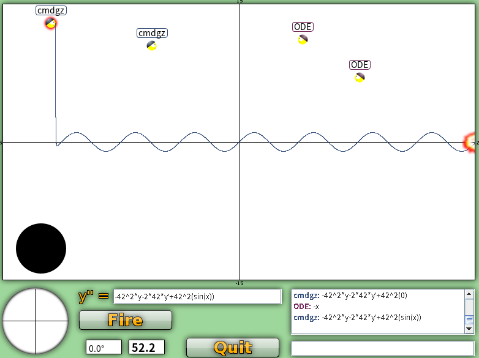

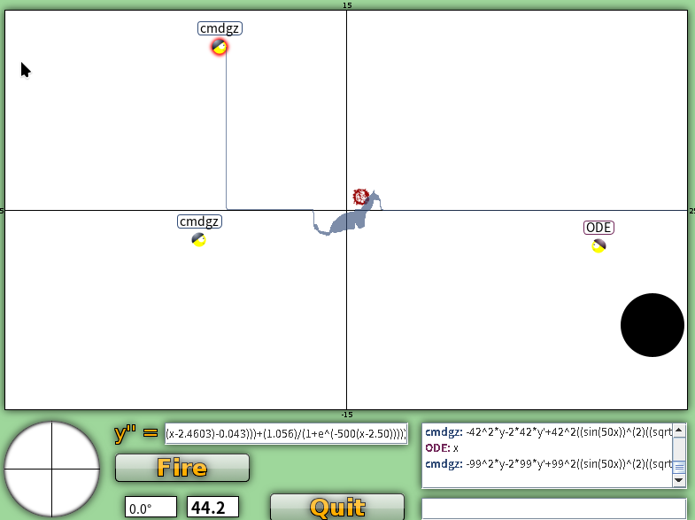

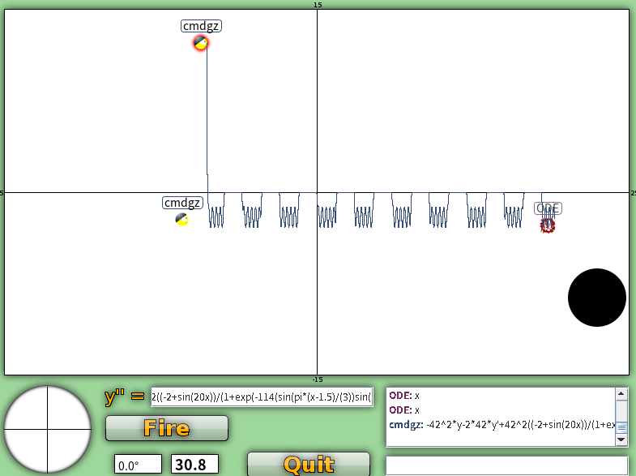

同样地：以下是对该公式的可行性证明：

**命题：**

令 $f$ 是一个可微函数，其中 $f'$ 有界。考虑以下IVP：

$$
\begin{cases}
\frac{d^2y}{dx^2}=-M^2y-2M\frac{dy}{dx}+M^2f(x)\\
y(x_0)=y_0\\
\frac{dy}{dx}(x_0)=y_0'
\end{cases}
$$

证明对于 $x>x_0$ ，当 $M\to+\infty$时其解将会收敛到$f(x)$ 。特别地，$y(x)=f(x)+\text{O}(\frac{1}{M})$。

**证明：**

​	由于 $\frac{d^2y}{dx^2}=-M^2y-2M\frac{dy}{dx}+M^2f(x)$ 等价于：

$$
\frac{d^2y}{dx^2}+2M\frac{dy}{dx}+M^2y=M^2f(x)\cdots(1)\\
$$

​	所以 $(1)$ 的通解可以被表示为 $y(x)=y_h(x)+y_p(x)$，其中 $y_p(x)$ 是一个特解， $y_h(x)$ 是如下方程的通解：

$$
\frac{d^2y}{dx^2}+2M\frac{dy}{dx}+M^2y=0\cdots(2)\\
$$

​	解 $(2)$ 的特征方程： $r^2+2Mr+M^2=0$ ，我们得到：$r_1=r_2=-M$

​	根据它我们可以得到 $(2)$ 的通解：

$$
y_h(x)=(C_1+C_2(x-x_0))e^{-M(x-x_0)}
$$

​	通过常数变易法，我们得到：

$$
y_p(x)=\int_{x_0}^xM^2(x-t)e^{-M(x-t)}f(t)dt
$$

​	是 $(1)$ 的一个特解

​	因此我们有：

$$
y(x)=y_h(x)+y_p(x)=(C_1+C_2(x-x_0))e^{-M(x-x_0)}+\int_{x_0}^xM^2(x-t)e^{-M(x-t)}f(t)dt
$$

​	由于 $y(x_0)=y_0,\frac{dy}{dx}(x_0)=y_0'$

​	我们可以得到：

$$
y(x)=(y_0+(y_0'+My_0)(x-x_0))e^{-M(x-x_0)}+\int_{x_0}^xM^2(x-t)e^{-M(x-t)}f(t)dt
$$

​	是该IVP的解

​	令 $M^2(x-t)e^{-M(x-t)}=\frac{\partial U(x,t)}{\partial t}$

​	故 $U(x,t)$ 可以是 $(1+M(x-t))e^{-M(x-t)}$

​	所以我们有：

$$
\begin{aligned}
y(x)&=(y_0+(y_0'+My_0)(x-x_0))e^{-M(x-x_0)}+\int_{x_0}^xM^2(x-t)e^{-M(x-t)}f(t)dt\\
&=(y_0+(y_0'+My_0)(x-x_0))e^{-M(x-x_0)}+\int_{x_0}^xf(t)\frac{\partial U}{\partial t}dt\\
&=(y_0+(y_0'+My_0)(x-x_0))e^{-M(x-x_0)}+\left.U(x,t)f(t)\right|_{x_0}^x-\int_{x_0}^xU(x,t)f'(t)dt\\
&=f(x)+(y_0-f(x_0)+(y_0'+M(y_0-f(x_0)))(x-x_0))e^{-M(x-x_0)}-\int_{x_0}^xU(x,t)f'(t)dt
\end{aligned}
$$

​	对于 $x>x_0$ 因为：

$$
\lim\limits_{M\to+\infty}(y_0-f(x_0)+(y_0'+M(y_0-f(x_0)))(x-x_0))e^{-M(x-x_0)}=0
$$

​	所以：

$$
y(x)=f(x)-\int_{x_0}^xU(x,t)f'(t)dt+\text{O}(\frac{M}{e^{M}})
$$

​	由于 $f'$ 有界

​	所以考虑 $\left|\int_{x_0}^xU(x,t)f'(t)dt\right|$，我们有：

$$
\begin{aligned}
\left|\int_{x_0}^xU(x,t)f'(t)dt\right|&\le\int_{x_0}^x|U(x,t)||f'(t)|dt\\
&\le (\sup|f'|)\int_{x_0}^x(1+M(x-t))e^{-M(x-t)}dt\\
&\le (\sup|f'|)\int_{0}^{x-x_0}(1+Mu)e^{-Mu}du\\
&\le(\sup|f'|)\int_{0}^{\infty}(1+Mu)e^{-Mu}du\\
&\le\frac{2\sup|f'|}{M}
\end{aligned}
$$

​	由于：

$$
\lim\limits_{M\to+\infty}\frac{2\sup|f'|}{M}=0
$$

​	所以：

$$
y(x)=f(x)+\text{O}(\frac{1}{M})+\text{O}(\frac{M}{e^{M}})=f(x)+\text{O}(\frac{1}{M})
$$

​	故 $y(x)=f(x)+\text{O}(\frac{1}{M})$

​	$\boxed{}$

#### 如果哪天开发者破天荒地推出了 $y^{(n)}$ 模式

我们可以这样构造类似的公式：

$$
\sum_{k=0}^{n} \binom{n}{k} M^{n-k}\frac{d^ky}{dx^k} = M^n f
$$

该可行性证明~~显而易见~~与上面差不多，~~我们邀请读者把它当作一个练习~~。实际上，~~有人托梦给我了这玩意~~。