# Graphwar Guide

Chinese version is here: [中文版本在这里](https://www.bilibili.com/read/readlist/rl1068466)

This is a simple guide for Graphwar, which contains some stuff should be note and some useful skill. And I'm aslo a beginer of this game who started to play it only a few days ago (And my English is not very good). So there may be some errors in this guide. If you find any errors or have any suggestions, please let me know.

Anyway, Graphwar is an artillery game in which you must hit your enemies using mathematical functions. The trajectory of your shot is determined by the function you wrote, and your goal is to avoid the obstacles and your teammates and hit your enemies. The game takes place in a Cartesian Plane.

## Contents

- [Graphwar Guide](#graphwar-guide)
  - [Contents](#contents)
  - [Something you should know](#something-you-should-know)
  - [Syntax](#syntax)
    - [Variables](#variables)
    - [Binary Operators](#binary-operators)
    - [Functions](#functions)
    - [Constants](#constants)
    - [Brackets](#brackets)
  - [Useful functions](#useful-functions)
    - [Step (Sigmoid) function:](#step-sigmoid-function)
    - [Spike function:](#spike-function)
    - [Double absolute function:](#double-absolute-function)
    - [Sine and cosine function:](#sine-and-cosine-function)
    - [General setp function:](#general-setp-function)
    - [Piecewise function approximation:](#piecewise-function-approximation)
    - [Periodic spike function:](#periodic-spike-function)
    - [Periodic general setp function:](#periodic-general-setp-function)
  - [ODE mode](#ode-mode)
    - [Mechanism](#mechanism)
    - [Skill](#skill)
    - [`y'` mode](#y-mode)
    - [`y''` mode](#y-mode-1)
    - [If the developer unprecedentedly pushes a $y^{(n)}$ mode](#if-the-developer-unprecedentedly-pushes-a-yn-mode)

## Something you should know

There are 2 temms in a game, and any player should and only could in one team.

After everyone chicking the $\checkmark$ button and getting green, the game will start after 5 seconds. So click the button, don't let other guys wait you.

A kinda annoying point is that there are many reason, such as someone join or leave the room, will make you turn back to white. Now you have to click the button again.

Your teamates and you are always on the left side ($x<0$). Your enemies are always on the right side ($x>0$). Or you can check someone's orientation to judge which side they are on: facing right is your teamates, facing left is your enemies. And you can kill your teamates in this game. So PLZ! don't kill your teamates! You know what? I've been killed because of this for many times.

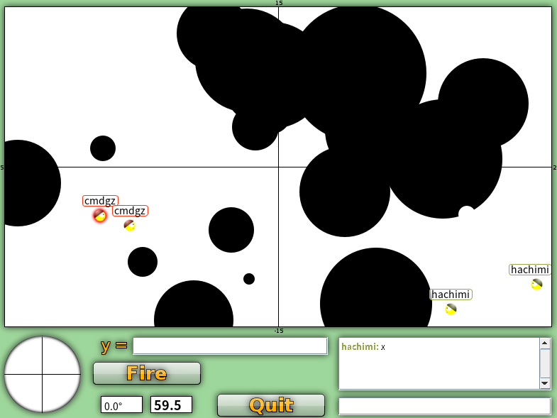

The character you control will become red when it's your turn. Now you can input any function expression in the input box. Chick "Fire" Button or press "Enter" to fire. The bullet will move according to the corresponding curve of your function from left to right. And you can only fire once per turn.

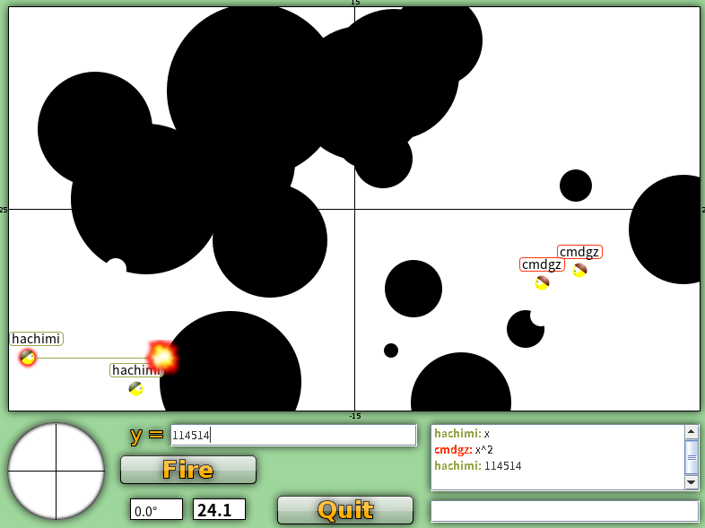

In the normal mode (`y` mode) (I'll talk about [ODE mode](#ode-mode) (`y'` and `y''` mode) later), assume the function you input is $f$, and your coordinates are $(x_0,y_0)$, then the real moving curve of your bullet is:

$$
f_{\text{real}}(x)=f(x)+(y_0-f(x_0))
$$

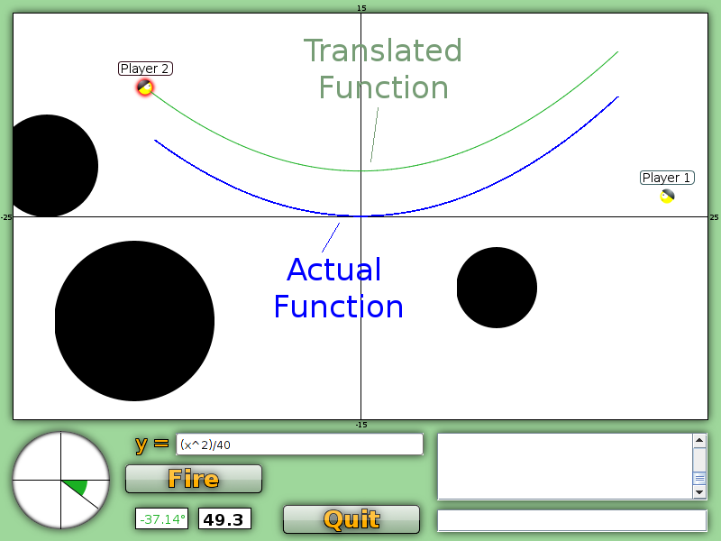

That is, instead of setting the posision of launcher be the origin of your function curve, the game will ensure that the function curve is always pass through the launcher's position by shifting the curve up or down. That's why you will get a very steep curve if you use $x^2$ or $x^3$. Trying use $(x-x_0)^2$ or $(x-x_0)^3$ will make it kinda normal.

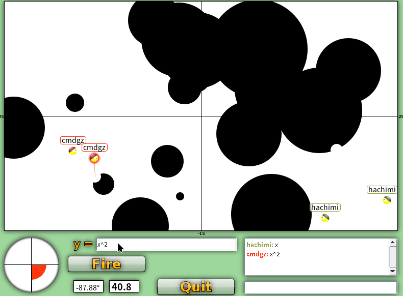

Clearly, $f_{\text{real}}$ is defined only for $x\ge x_0$. So the curve doesn't exist for $x<x_0$.

Since you can only input a function expression in the input box, which means for any input $x$ there is at most one corresponding $f(x)$. It's impossible that an input correspond to multiple values. So it's clearly that the bullet can not move to the left, that is, the $-x$ direction.

The black fucking circles are obstacles. If your bullet hits them, it will explode and make a small hole, and the bullet will disappear.

If your bullet hit your teamates or your enemies, they will be killed but your bullet will continue to move.

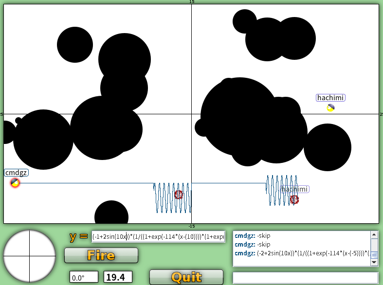

The battlefield is in a $[-25,25]\times[-15,15]$ rectangular area. If the bullet hits the boundary, it will disappear.

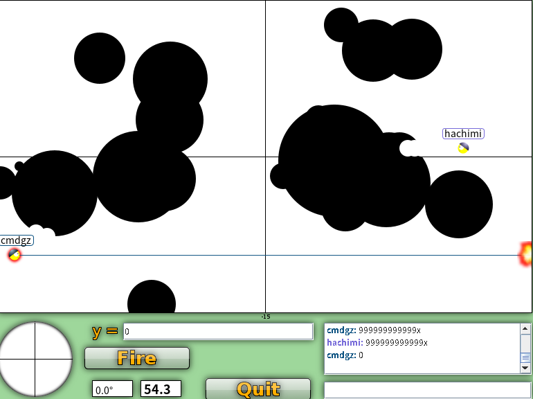

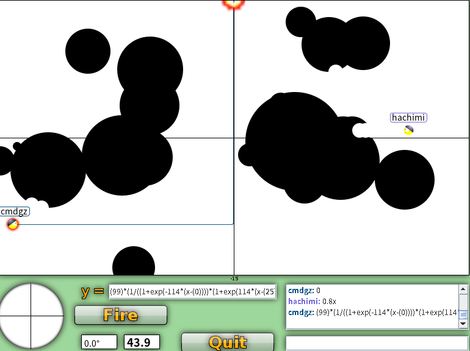

If the function is undefined at the point that bullet passes through, like $y=\sqrt{x}$ and the bullet passes through some $x<0$, the bullet will disappear.

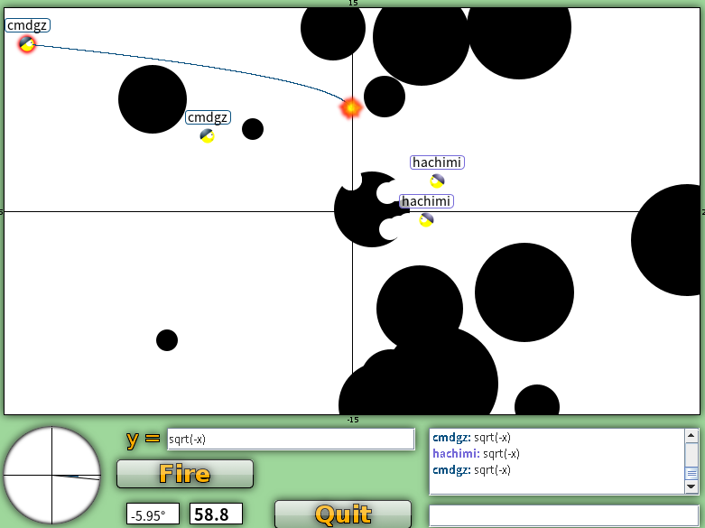

If the function value is too large, or more fundamentally and more generally, the function value is `NaN`, the bullet will disappear.

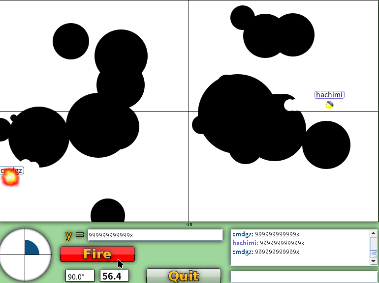

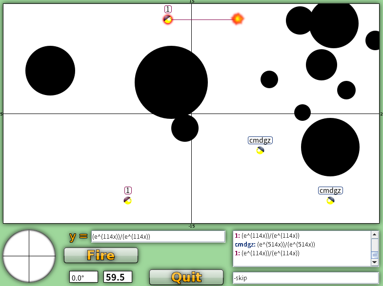

The distance your bullet can move, that is , the length of your function curve, is finite. If the distance is too long, the bullet will disappear. That's why something like $sin(100x)$ usually doesn't work.

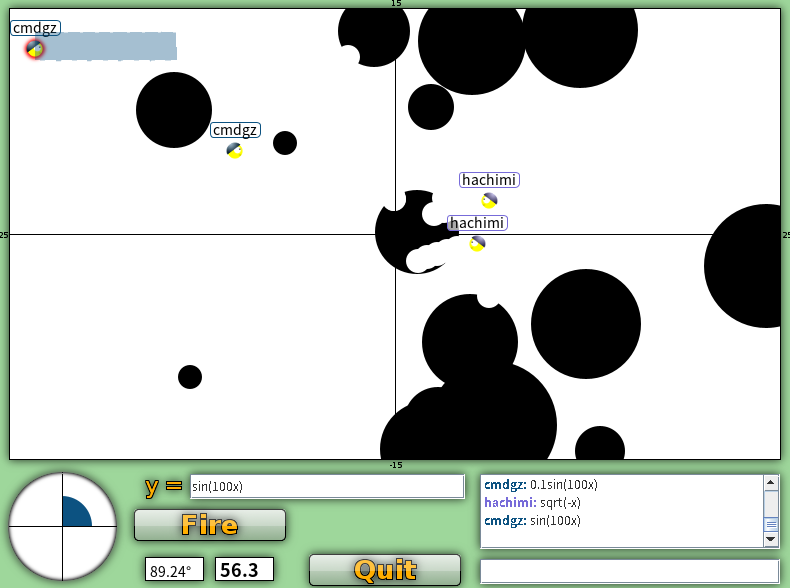

The map of a game is random. If you get a dumbass map, type `-skip` in the chat box and ask other guys to type it. The game will change a new random map if everyone types `-skip`.

## Syntax

### Variables

- `x`:  $x$
- `y`:  $y$
- `y'`: $y'$

### Binary Operators

- `+`: $+$
- `-`: $-$
- `*`: $\times$
- `/`: $\div$
- `^`: power, such as `x^2` is $x^2$

### Functions

- `sqrt()`: square root, such as `sqrt(x)` is $\sqrt{x}$
- `ln()`: natural logarithm, such as `ln(x)` is $ln(x)$
- `log()`: common logarithm, such as `log(x)` is $log_{10}(x)$
- `abs()`: absolute value, such as `abs(x)` is $|x|$
- `sin()` or `sen()`: sine, such as `sin(x)` is $sin(x)$
- `cos()`: cosine, such as `cos(x)` is $cos(x)$
- `tan()` or `tg()`: tangent, such as `tan(x)` is $tan(x)$
- `exp()`: exponential, such as `exp(x)` is $e^x$

### Constants

- `pi`: $\pi$
- `e`: $e$

### Brackets

- `(` and `)`: brackets. Using brackets more frequently to avoid incorrect order of operations.

## Useful functions

Some of following contents are from [Graphwar Tutorial Sant Albert '12](https://www.youtube.com/watch?v=E_MmkxTO5kg) and [graphwar meta that i use (EN)](https://www.youtube.com/watch?v=EHuQe7SKwkA)

And you can combine them by summing and multiplying. Abstractly, summing means "OR", and multiplying means "AND".

### Step (Sigmoid) function:

$$
\frac{k}{1+e^{-m(x-a)}}
$$

That is: `((k)/((1+exp(-m*(x-(a))))))`

where $m\in\mathbb{R}_+$ is a big positive number.

This function can approximate the following function:

$$
\begin{cases}
0, & x\lt a\\
k, & x\ge a
\end{cases}
$$

That is, the function is 0 when $x\lt a$, and $k$ when $x\ge a$.

Particularly, let $k$ be a negative number to let the bullet move down.

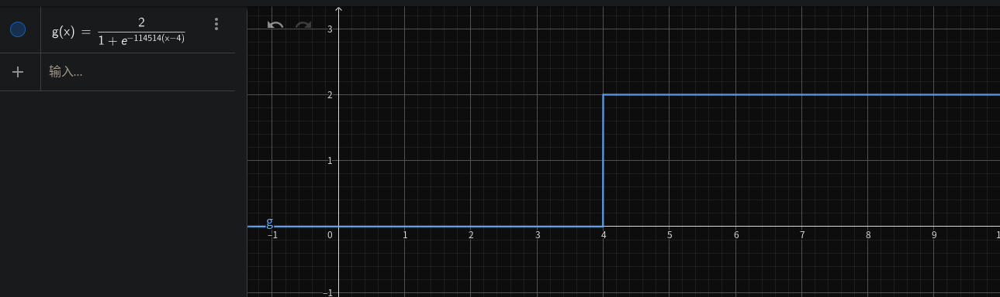

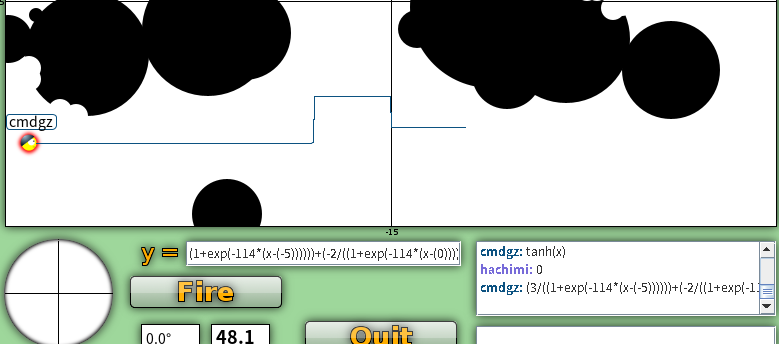

It's a very useful and simple function used to move and dodge the objects.

### Spike function:

$$
\frac{h}{1+m(x-a)^2}
$$

That is: `((h)/(1+m*(x-a)^2))`

where $m\in\mathbb{R}_+$ is a big positive number.

The function creates a spike at $x=a$ with height $h$.

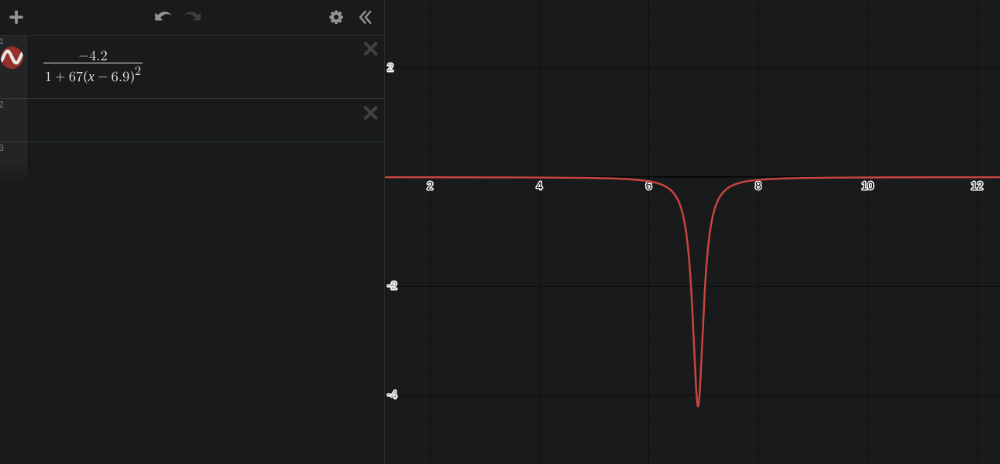

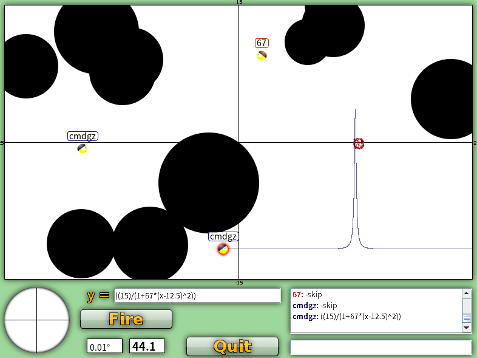

Compared to use something like $\frac{h}{1+m(x-a)^2}+\frac{-h}{1+m(x-a-0.1)^2}$, the function is simpler and easier to use.

### Double absolute function:

$$
\frac{k}{2}(|x-a| - |x-b|)
$$

That is: `(0.5*(k)(abs(x-(a))-abs(x-(b))))`

where $a<b$

The function eqvalents to the following function:

$$
\begin{cases}
-\frac{k}{2}|a-b|, & x\lt a\\
k(x-a)-\frac{k}{2}|a-b|, & x\in[a,b]\\
\frac{k}{2}|a-b|, & x\gt b
\end{cases}
$$

which means the function is $-k/2|a-b|$ when $x\lt a$, a linear function will slope $k$ when $x\in[a,b]$, and $k/2|a-b|$ when $x\gt b$

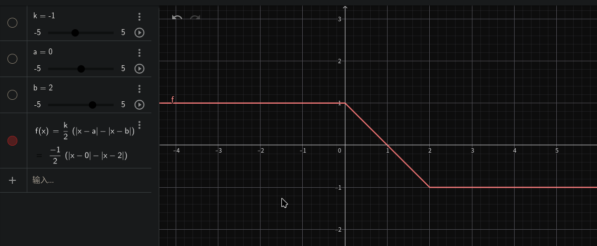

**There are so many cheaters like to use the combination of the function. If you see someone send a whole string of this stuff with verey precise coefficients, it's very likely to be a cheater.**

### Sine and cosine function:

Although $\sin$ and $\cos$ are very basic, they are very useful to sweep a wide area if you give them a big angular velocity.

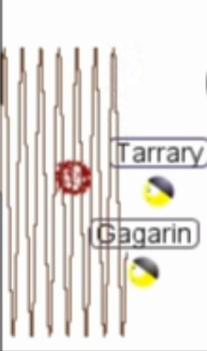

### General setp function:

$$
\frac{f(x)}{1+e^{-m(x-a)}}
$$

That is: `((f)/((1+exp(-m*(x-(a))))))`

where $m\in\mathbb{R}_+$ is a big positive number.

This function can approximate the following function:

$$
\begin{cases}
0, & x\lt a\\
f(x), & x\ge a
\end{cases}
$$

That is, the function is 0 when $x\lt a$, and $f(x)$ when $x\ge a$.

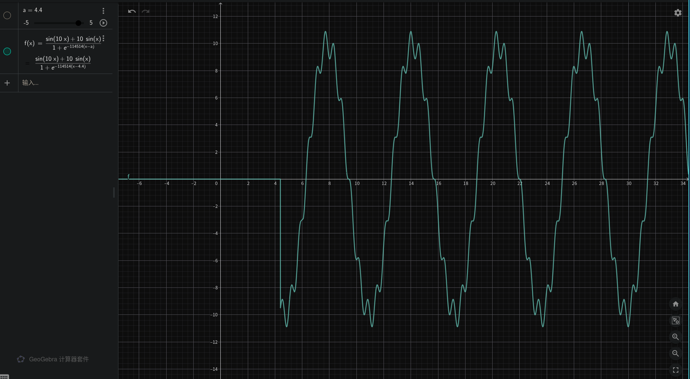

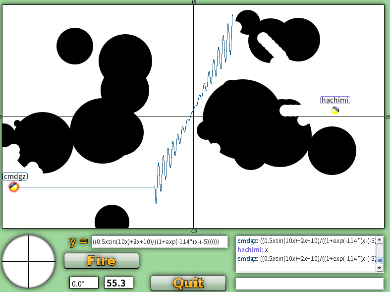

This function can be used to make any function $f(x)$ works only after pass through a certain point. But if you want to let it works only for a interval, General setp function can't help you. Now you need the flowing stuff.

### Piecewise function approximation:

Let

$$
\mathbf 1_{(a,b)}(x)=\frac{1}{(1+e^{-m(x-a)})(1+e^{m(x-b)})}
$$

That is `(1/((1+exp(-m*(x-(a))))*(1+exp(m*(x-(b))))))`

where $m\in\mathbb{R}_+$ is a big positive number and $a<b$

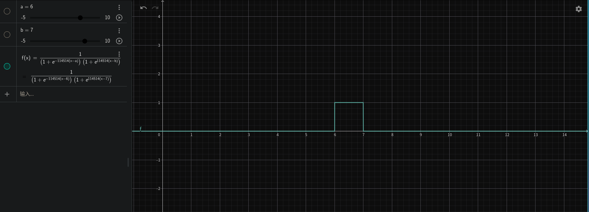

to approximate the indicator function:

$$
\mathbb1_{[a,b]}(x)=
\begin{cases}
1, & x\in[a,b]\\
0, & \text{Otherwise}
\end{cases}
$$

You may notice that the function is just the multiplication of a step function and a step-like function.

(And btw I constructed another version of $\mathbf 1_{(a,b)}(x)$ by combining power function like: $\mathbf1_{(a,b)}(x)=\left(1+\left(\frac{x-\frac{a+b}{2}}{\frac{a-b}{2}}\right)^{2m}\right)^{-1}$. But it's not useful because you have to replace $a$ and $b$ twice and $m$ must be a natural number.)

Let's consider the piecewise function:

$$
f(x)=
\begin{cases}
f_1(x), & x\in[a_1,b_1]\\
f_2(x), & x\in[a_2,b_2]\\
\vdots\\
f_n(x), & x\in[a_n,b_n]\\
0, & \text{Otherwise}
\end{cases}
$$

where $a_i<b_i$ for $i=1,2,\cdots,n$

And the piecewise function can be approximated by:

$$
f(x)\approx\sum_{i=1}^n\mathbf1_{(a_i,b_i)}(x)f_i(x)
$$

That is, the sum of something like `((f)*(1/((1+exp(-m*(x-(a))))*(1+exp(m*(x-(b)))))))`

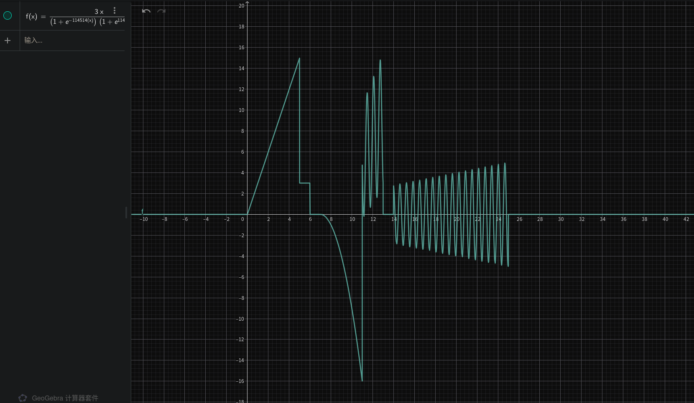

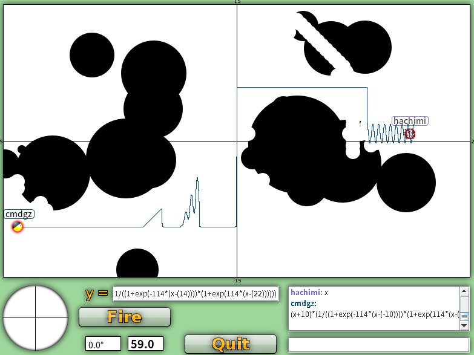

If you played with me in the game, you will see that I usually use this function to construct any function I want. It's very useful for me, which is one of the best function in my mind.

### Periodic spike function:

$$
\frac{h}{(1+m(\sin(\frac{\pi x}{T}))^2)}
$$

That is: `((h)/(1+m*(sin((pi*x)/(T)))^2))`

where $m\in\mathbb{R}_+$ is a big positive number.

The function creates a spike every $T$ units.

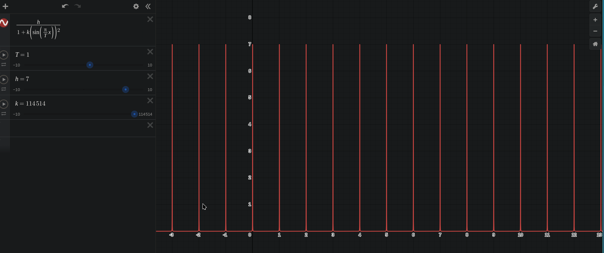

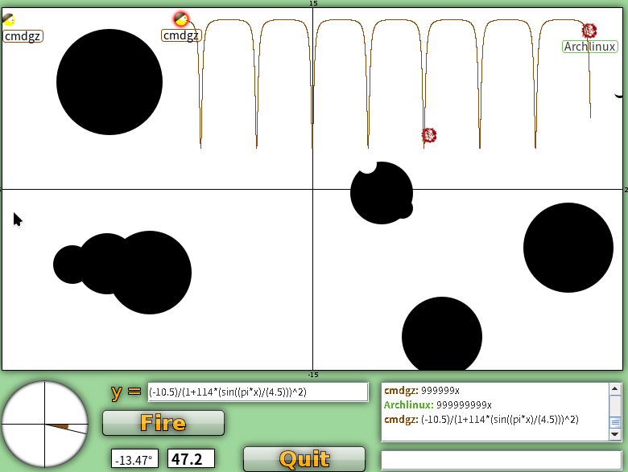

This function can also sweep a wide area by creating many spikes.

### Periodic general setp function:

$$
\frac{f(x)}{1+e^{-m\left(\sin\left(\frac{\pi(x-p)}{T}\right)\sin\left(-\frac{\pi x}{T}\right)\right)}}
$$

That is: `((f)/(1+exp(-m*(sin(pi*(x-p)/(T))sin(-(pi*x)/(T))))))`

where $m\in\mathbb{R}_+$ is a big positive number, $T$ is the period, and $p\in(0,T)$.

In a period $[kT,kT+T)$, the function will be $f$ if $x\in[kT,kT+p)$, otherwise it will be $0$.

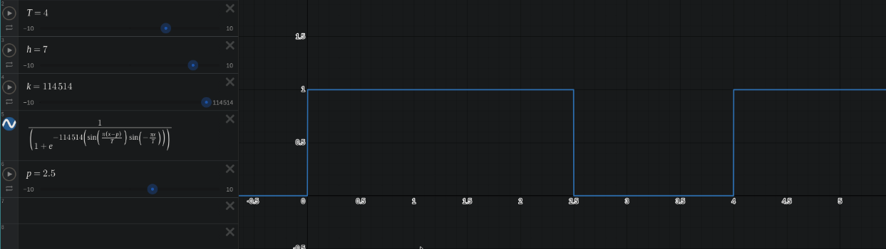

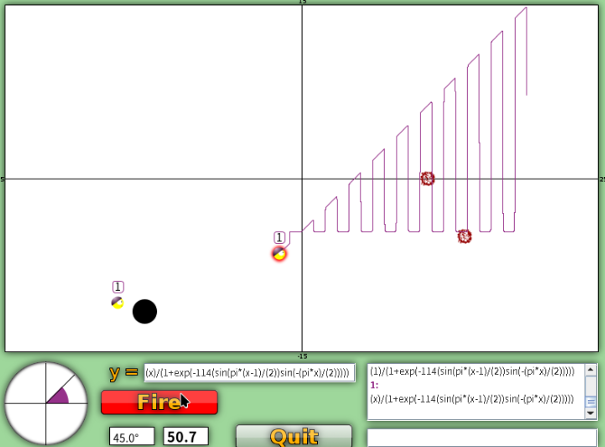

Based on this function, you can do many interesting things.

## ODE mode

### Mechanism

As you can see, there are 2 modes of ODE mode: `y'` mode and `y''` mode, corresponding to the first and second derivatives of $y$ with respect to $x$.

Like the normal mode, you can input any function expression in the input box to set the trajectory of your bullet. But it allows you to use variables other than $x$, like $y$ in `y'` mode and $y,y'$ in `y''` mode. (For the variable `y'`. There was a bug in the previous version which made it would be matched with `y` instead of `y'`. But I has been fixed in the latest version. So remember to update your game.)

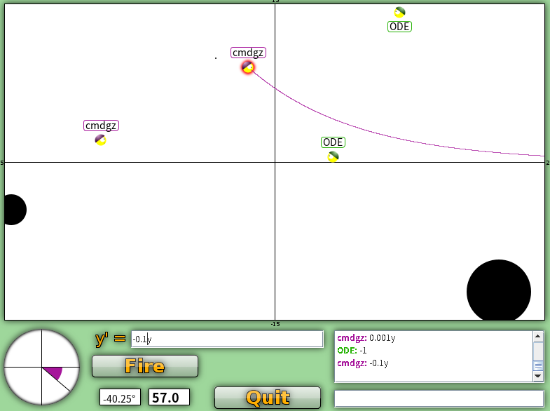

As [Syntax](#syntax) said, `y` means $y$, and `y'` means $\frac{dy}{dx}$.

Instead of regarding the expression as a function, the game will treat it as an ordinary differential equation (ODE) to describe the moving curve of your bullet.

Assume you have understood the above stuff, I will show you how the bullet moves in ODE mode.

Assume the coordinates of the launcher are $(x_0,y_0)$

For the first order ODE i.e. `y'` mode, assume the expression you input is $E(x,y)$, then the corresponding moving curve of your bullet is the solution of the following Initial Value Problem (IVP):

$$
\begin{cases}
\frac{dx}{dy}=E(x,y)\\
y(x_0)=y_0
\end{cases}
$$

For the second order ODE i.e. `y''` mode, the moving curve is also the solution of a certain IVP, but it's clear that you need $2$ initial conditions instead of $1$ in this case. The first initial condition is the same, the game sets the firing angle be the second initial condition, which can be modify by pressing the up/down arrow keys in your turn.

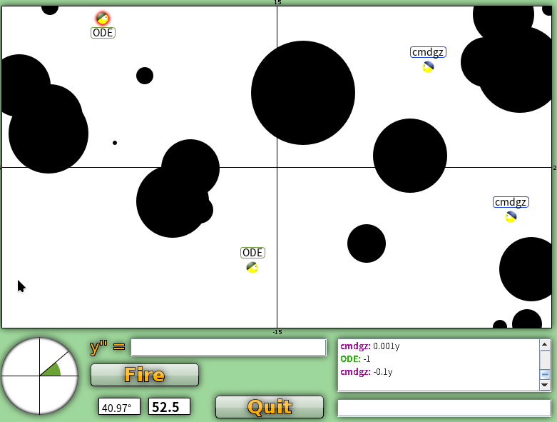

Assume the firing angle is $\theta$, the expression you input is $E(x,y,\frac{dy}{dx})$ (i.e. $E(x,y,y')$), then the corresponding moving curve of your bullet is the solution of the following Initial Value Problem (IVP):

$$
\begin{cases}
\frac{dx}{dy}=E(x,y)\\
y(x_0)=y_0\\
\frac{dy}{dx}(x_0)=\tan\theta
\end{cases}
$$

Graphar compute the curve by using 4th order Runge-Kutta method whatever `y'` mode or `y''` mode because any $n$th ODE is eqvalent to a first order ODE system. As the following stuff:

$$
\begin{cases}
w_0=y_0\\
w_{i+1}=w_i+\frac{1}{6}(k_1+2k_2+2k_3+k_4)
\end{cases}
$$

where

$$
k_1=hf(t_1,w_i)\\
k_2=hf(t_1+\frac{h}{2},w_i+\frac{1}{2}k_1)\\
k_3=hf(t_1+\frac{h}{2},w_i+\frac{1}{2}k_2)\\
k_4=hf(t_1+h,w_i+k_3)
$$

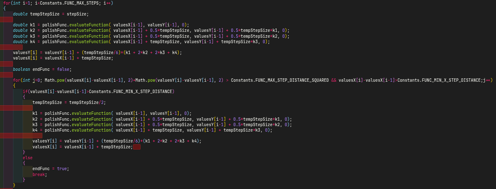

### Skill

Perhaps you'll say that it's too difficult to construct a curve you want in ODE mode, it seems that the useful functions and skills in the normal mode are useless stuff here. Because looks like you have to compute the first order or even the second order derivative of the above functions, which is too complex and even almost impossible in some cases such as `abs()`. But don't worry, if I'll tell you there is a kind of way to approxmate the function in normal mode by a simple ODE to avoid any derivative?

Next let's assume the function you want to cook is $f$, the following way can make the moving curve of your bullet **EXACTLY** the approximation to the curve of $f$ i.e. it is not like the normal mode, $f$ won't be shifted up or down. That is, you don't need to guess your $y_0$ coordinate any more if you use the skill I'll tell in ODE mode. So from the point, it seems that the ODE mode is easier than the normal mode.

Assume $M$ be a big positive number, normally $M=233$ is enough. (If $M$ is too big, the final curve will oscillates very frequently somehow, the length of the curve will easily exceed the upper bound).

### `y'` mode

$$
M(-y+f)
$$

That is: `M*(-y+(f))`

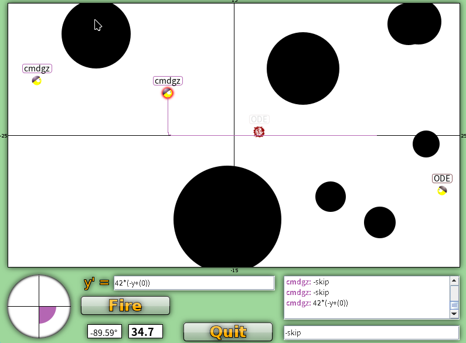

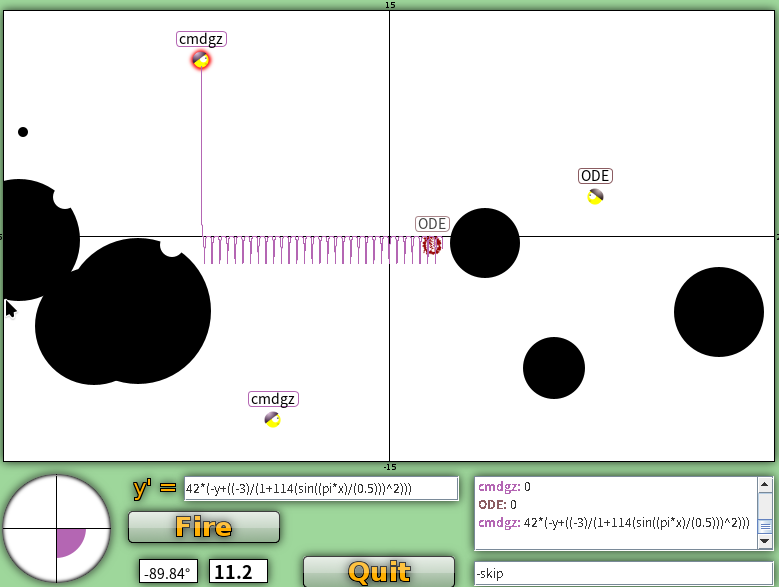

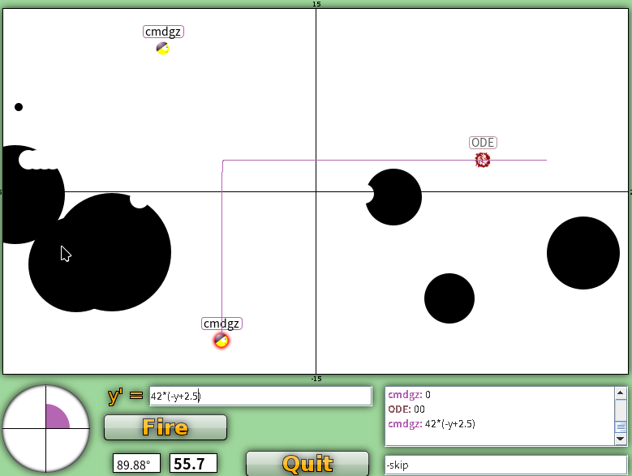

Here is the strict proof of the validity:

**Proposition:**

Let $f$ be a differential function where $f'$ is bounded. Consider the following IVP:

$$
\begin{cases}
\frac{dy}{dx}=M(-y+f(x))\\
y(x_0)=y_0
\end{cases}
$$

Prove that the solution will converge to $f(x)$ for any $x>x_0$ when $M\to+\infty$. Particularly, $y(x)=f(x)+\text{O}(\frac{1}{M})$.

**Proof:**

​	Since this is a first-order linear ODE

​	So the solution is:

$$
y(x)=e^{-M(x-x_0)}y_0+e^{-Mx}\int_{x_0}^xMf(t)e^{Mt}dt
$$

​	Then we have:

$$
\begin{aligned}
y(x)&=e^{-M(x-x_0)}y_0+e^{-Mx}\int_{x_0}^xMf(t)e^{Mt}dt\\
&=e^{-M(x-x_0)}y_0+e^{-Mx}\int_{x_0}^xf(t)de^{Mt}\\
&=e^{-M(x-x_0)}y_0+e^{-Mx}\left.f(t)e^{Mt}\right|_{x_0}^x-e^{-Mx}\int_{x_0}^xe^{Mt}df(t)\\
&=e^{-M(x-x_0)}y_0+f(x)e^{Mx}e^{-Mx}-f(x_0)e^{Mx_0}e^{-Mx}-e^{-Mx}\int_{x_0}^xe^{Mt}f'(t)dt\\
&=f(x)+(y_0-f(x_0))e^{-M(x-x_0)}-e^{-Mx}\int_{x_0}^xe^{Mt}f'(t)dt\\
&=f(x)+\text{O}(\frac{1}{e^M})-e^{-Mx}\int_{x_0}^xe^{Mt}f'(t)dt\\
\end{aligned}
$$

​	Since $\lim\limits_{M\to+\infty}(y_0-f(x_0))e^{-M(x-x_0)}=0$ for $x>x_0$

​	So

$$
y(x)=f(x)-e^{-Mx}\int_{x_0}^xe^{Mt}f'(t)dt+\text{O}(\frac{1}{e^M})
$$

​	Since $f'$ is bounded

​	So Consider $\left|e^{-Mx}\int_{x_0}^xe^{Mt}f'(t)dt\right|$, we have:

$$
\begin{aligned}
\left|e^{-Mx}\int_{x_0}^xe^{Mt}f'(t)dt\right|&\le e^{-Mx}\int_{x_0}^x|e^{Mx}||f'(x)|dx\\
&\le (\sup|f'|)e^{-Mx}\int_{x_0}^xe^{Mx}dx\\
&\le (\sup|f'|)e^{-Mx}\frac{e^{Mx}-e^{Mx_0}}{M}\\
&\le (\sup|f'|)e^{-Mx}\frac{e^{Mx}}{M}\\
&\le \frac{\sup|f'|}{M}\\
\end{aligned}
$$

​	Since $\lim\limits_{M\to+\infty}\frac{\sup|f'|}{M}=0$

​	So

$$
y(x)=f(x)+\text{O}(\frac{1}{M})+\text{O}(\frac{1}{e^M})=f(x)+\text{O}(\frac{1}{M})
$$

​	So $y(x)=f(x)+\text{O}(\frac{1}{M})$

​	$\boxed{}$

### `y''` mode

$$
-M^2y-2M\frac{dy}{dx}+M^2f
$$

That is: `-M^2*y-2*M*y'+M^2(f)`

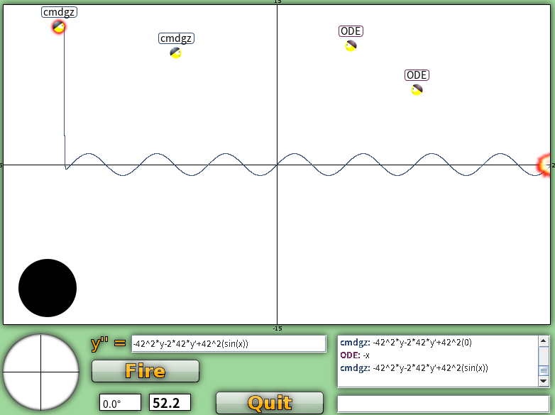

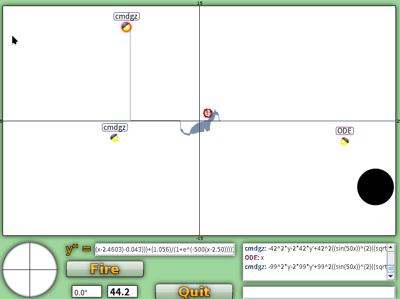

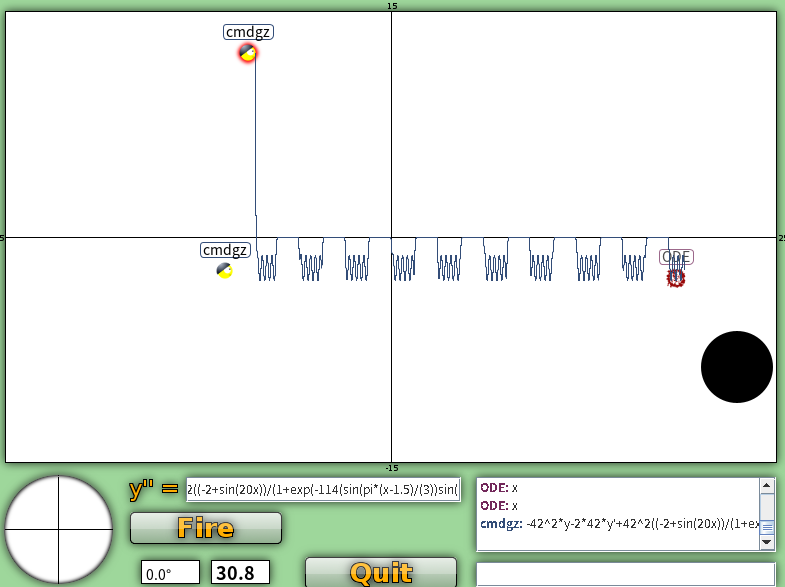

Also, here is the strict proof of the validity:

**Proposition:**

Let $f$ be a differential function where $f'$ is bounded. Consider the following IVP:

$$
\begin{cases}
\frac{d^2y}{dx^2}=-M^2y-2M\frac{dy}{dx}+M^2f(x)\\
y(x_0)=y_0\\
\frac{dy}{dx}(x_0)=y_0'
\end{cases}
$$

Prove that the solution will converge to $f(x)$ for any $x>x_0$ when $M\to+\infty$. Particularly, $y(x)=f(x)+\text{O}(\frac{1}{M})$.

**Proof:**

​	Since $\frac{d^2y}{dx^2}=-M^2y-2M\frac{dy}{dx}+M^2f(x)$ is equivalent as

$$
\frac{d^2y}{dx^2}+2M\frac{dy}{dx}+M^2y=M^2f(x)\cdots(1)\\
$$

​	So the general solution of $(1)$ can be expressed as $y(x)=y_h(x)+y_p(x)$, where $y_p(x)$ is a particular solution and $y_h(x)$ is a solution of

$$
\frac{d^2y}{dx^2}+2M\frac{dy}{dx}+M^2y=0\cdots(2)\\
$$

​	Solve the characteristic equation of $(2)$: $r^2+2Mr+M^2=0$, we get $r_1=r_2=-M$

​	So we get the general solution of $(2)$:

$$
y_h(x)=(C_1+C_2(x-x_0))e^{-M(x-x_0)}
$$

​	By variation of parameters, we get:

$$
y_p(x)=\int_{x_0}^xM^2(x-t)e^{-M(x-t)}f(t)dt
$$

​	is a particular solution of $(1)$

​	So we have:

$$
y(x)=y_h(x)+y_p(x)=(C_1+C_2(x-x_0))e^{-M(x-x_0)}+\int_{x_0}^xM^2(x-t)e^{-M(x-t)}f(t)dt
$$

​	Since $y(x_0)=y_0,\frac{dy}{dx}(x_0)=y_0'$

​	We get:

$$
y(x)=(y_0+(y_0'+My_0)(x-x_0))e^{-M(x-x_0)}+\int_{x_0}^xM^2(x-t)e^{-M(x-t)}f(t)dt
$$

​	Is the solution of the IVP

​	Let $M^2(x-t)e^{-M(x-t)}=\frac{\partial U(x,t)}{\partial t}$

​	So $U(x,t)$ can be $(1+M(x-t))e^{-M(x-t)}$

​	So we have

$$
\begin{aligned}
y(x)&=(y_0+(y_0'+My_0)(x-x_0))e^{-M(x-x_0)}+\int_{x_0}^xM^2(x-t)e^{-M(x-t)}f(t)dt\\
&=(y_0+(y_0'+My_0)(x-x_0))e^{-M(x-x_0)}+\int_{x_0}^xf(t)\frac{\partial U}{\partial t}dt\\
&=(y_0+(y_0'+My_0)(x-x_0))e^{-M(x-x_0)}+\left.U(x,t)f(t)\right|_{x_0}^x-\int_{x_0}^xU(x,t)f'(t)dt\\
&=f(x)+(y_0-f(x_0)+(y_0'+M(y_0-f(x_0)))(x-x_0))e^{-M(x-x_0)}-\int_{x_0}^xU(x,t)f'(t)dt
\end{aligned}
$$

​	Since $\lim\limits_{M\to+\infty}(y_0-f(x_0)+(y_0'+M(y_0-f(x_0)))(x-x_0))e^{-M(x-x_0)}=0$ for $x>x_0$

​	So

$$
y(x)=f(x)-\int_{x_0}^xU(x,t)f'(t)dt+\text{O}(\frac{M}{e^{M}})
$$

​	Since $f'$ is bounded

​	So consider $\left|\int_{x_0}^xU(x,t)f'(t)dt\right|$, we have:

$$
\begin{aligned}
\left|\int_{x_0}^xU(x,t)f'(t)dt\right|&\le\int_{x_0}^x|U(x,t)||f'(t)|dt\\
&\le (\sup|f'|)\int_{x_0}^x(1+M(x-t))e^{-M(x-t)}dt\\
&\le (\sup|f'|)\int_{0}^{x-x_0}(1+Mu)e^{-Mu}du\\
&\le(\sup|f'|)\int_{0}^{\infty}(1+Mu)e^{-Mu}du\\
=&\le\frac{2\sup|f'|}{M}
\end{aligned}
$$

​	Since $\lim\limits_{M\to+\infty}\frac{2\sup|f'|}{M}=0$

​	So

$$
y(x)=f(x)+\text{O}(\frac{1}{M})+\text{O}(\frac{M}{e^{M}})=f(x)+\text{O}(\frac{1}{M})
$$

​	So $y(x)=f(x)+\text{O}(\frac{1}{M})$

​	$\boxed{}$

### If the developer unprecedentedly pushes a $y^{(n)}$ mode

We can construct like that:

$$
\sum_{k=0}^{n} \binom{n}{k} M^{n-k}\frac{d^ky}{dx^k} = M^n f
$$

The proof is ~~trivial~~ similar to the above proofs. ~~The reader is invited to do it as an exercise.~~ In fact, ~~this was once revealed to me in a dream~~.